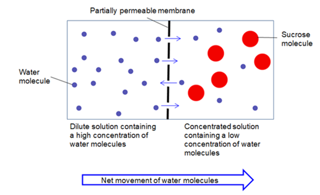
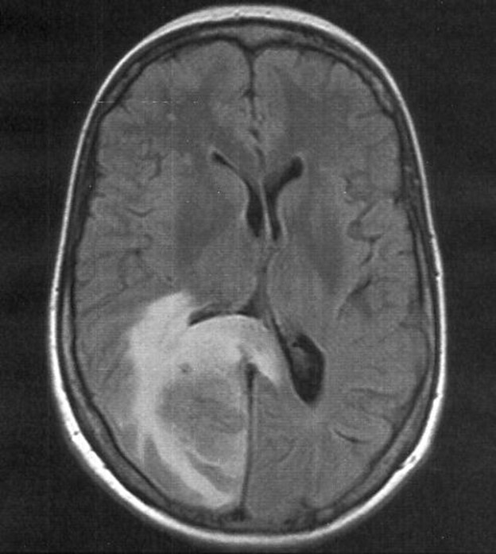

12 January 2007. California. On a morning radio show, an excruciating contest was going on. Named 'Hold your wee for a Wii' [1][3] by the now-defunct KDND radio station, 18 contestants were downing bottles of water one after the other, on the condition that whoever could drink the most while not urinating would win a Nintendo Wii gaming console as a prize. Contestants agonizingly crammed down mouthfuls of liquid down their throats, while the hosts egged them on with gleeful laughter. As time ticked by, some could no longer endure such an ordeal, dropping out in the middle and probably wondering why they had signed up to such a torturous session. “She looks like she’s pregnant,” sniggered one of the DJs, pointing to a female participant with an overwhelmingly bloated stomach. Little did they know, she would be dead in a few hours.

Jennifer Strange, 28, had passed away from overhydration, by literally drinking much more water than her body could handle.

While it’s “common sense” that the overconsumption of pretty much any substance can lead to some unpleasant repercussions, the exact science behind it isn’t so straightforward. In this article, I will attempt to break down the mechanism of water poisoning in simple layman’s terms.

When excessive amounts of water are consumed in a short period of time, the kidneys, the organs responsible for filtering waste out of your body fluids, simply cannot work fast enough. Liters of water are now circulating throughout the bloodstream, diluting blood to a large extent. This means that there is a very high concentration of water molecules outside of the cells. In contrast, the fluid inside human cells consists of a wide array of substances, with potassium, magnesium and sulfate ions just to name a few. Hence, at this point, the concentration of water molecules is lower inside the cell than outside (it isn’t as diluted)

_A diagram that demonstrates the process of osmosis, using sucrose and water as examples._

And this is when the principle of osmosis comes into play. For those who may not be aware, osmosis is when solvent molecules naturally diffuse from an area of high to low concentration across a semi-permeable membrane. For the sake of argument, let’s say that across such a membrane there are two sides, one with 100% water and the other side with 50% water. In this case, we would see water moving into the side with less water molecules (i.e., the 50% side). To visualize this phenomenon easily, try placing a dried raisin into water. Overtime, it will slowly expand in size as it absorbs water from its surroundings. Why? Because the inside of a raisin has less water than the outside, and by osmosis water will go in. The same applies to human cells. With much more water present in blood, they are taken up by cells which swell up massively to accommodate more liquid.

Swelling cells isn’t that big of an issue for many parts of your body, but that doesn’t apply to the brain. Enclosed tightly inside the skull cavity, brain cells simply have no room to expand. What then occurs is the swollen brain tightly pressing against the sides of the skull, leading to headaches, one of the first symptoms to be observed, accompanied with nausea and mental disorientation. The heavy pressure also obstructs blood flow, leading to chances of seizures or the victim simply falling unconscious. This phenomenon, cerebral edema, is known to be a major cause of strokes and traumatic brain injuries.  	 
 

_MRI Scan of a brain affected by cerebral edema [2]_

One prominent risk factor that increases the risk of overhydration is heavy sweating and physical activity, when one is more prone to drinking an excessive amount of water unknowingly. Marathon runners are particularly susceptible, with a 2005 study [4] showing that 13% of Boston Marathon participants ended up with hyponatremia (low sodium concentration in blood), a symptom of overhydration. The researchers concluded that this was linked to “consumption of more than 3 liters of fluid during the race”. In a separate investigation by the American armed forces [5], three soldier deaths attributed to water intoxication were uncovered, where the water intakes of the victims “reached 5 liters, usually 10-20 liters in just a few hours”. 

And what can be done about this? In serious cases, diuretics, a class of drugs that increases urine production, can be administered to get rid of excess water quicker. A second treatment involves the use of VRAs, substances that interfere with the hormone vasopressin at its receptors. This hormone instructs the kidney to conserve more water, and by inhibiting its action, urine volume is increased. 

If you’re feeling ever so slightly uneasy having read to this point, please do not be concerned. Healthy human kidneys can process around 1L of water (Approx. 4 average-sized glasses) per hour, and in many cases the condition is relatively mild where no significant symptoms are noticed. Considering that the commonly said “8 glasses of water per day” only amounts to around 2-3L, there should be zero concern for overhydration as long as you’re not guzzling more than half of your daily water intake in a single sitting.

## Bibliography
1. Anon, 2007. Woman dies after water-drinking contest. NBCNews.com. Available at: https://www.nbcnews.com/id/wbna16614865 [Accessed August 31, 2022]. 
2. Hider, P., 2008. T2 FLAIR axial MRI sequence showing right occipital lesion with surrounding vasogenic oedema causing mass effect on the occipital horn of the right lateral ventricle . Available at: https://www.researchgate.net/figure/T2-FLAIR-axial-MRI-sequence-showing-right-occipital-lesion-with-surrounding-vasogenic_fig2_5370447 [Accessed August 31, 2022]. 
3. Ballantyne, C., 2007. Strange but true: Drinking too much water can kill. Scientific American. Available at: https://www.scientificamerican.com/article/strange-but-true-drinking-too-much-water-can-kill/ [Accessed August 31, 2022]. 
4. Almond, C.S.D. et al., 2005. Hyponatremia among runners in the Boston Marathon: Nejm. New England Journal of Medicine. Available at: https://www.nejm.org/doi/full/10.1056/nejmoa043901 [Accessed August 31, 2022]. 
5. John W. Gardner, MC FS USA, Death by Water Intoxication, Military Medicine, Volume 167, Issue 5, May 2002, Pages 432–434. Available at: https://doi.org/10.1093/milmed/167.5.432 [Accessed August 31, 2022]. 
