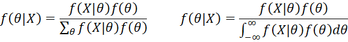

## What is Bayesian Statistics?

Bayesian statistics is a particular approach to applying probability to statistical problems. It provides us with mathematical tools to update our beliefs about random events in light of seeing new data or evidence about those events.

In particular Bayesian inference interprets probability as a measure of believability or confidence that an individual may possess about the occurance of a particular event.

We may have a prior belief about an event, but our beliefs are likely to change when new evidence is brought to light. Bayesian statistics gives us a solid mathematical means of incorporating our prior beliefs, and evidence, to produce new posterior beliefs.

Bayesian statistics provides us with mathematical tools to rationally update our subjective beliefs in light of new data or evidence.

This is in contrast to another form of statistical inference, known as classical or frequentist statistics, which assumes that probabilities are the frequency of particular random events occuring in a long run of repeated trials.

For example, as we roll a fair (i.e. unweighted) six-sided die repeatedly, we would see that each number on the die tends to come up 1/6 of the time.

Frequentist statistics assumes that probabilities are the long-run frequency of random events in repeated trials.

When carrying out statistical inference, that is, inferring statistical information from probabilistic systems, the two approaches - frequentist and Bayesian - have very different philosophies.

Frequentist statistics tries to eliminate uncertainty by providing estimates. Bayesian statistics tries to preserve and refine uncertainty by adjusting individual beliefs in light of new evidence.

