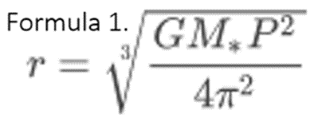
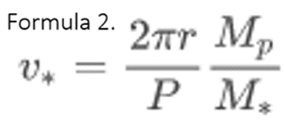
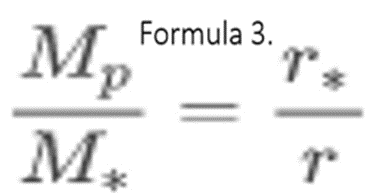
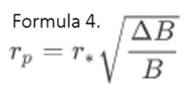
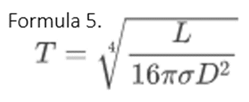
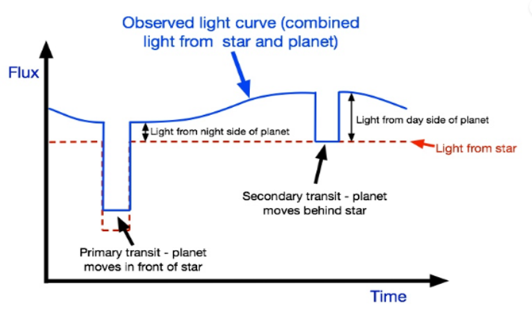
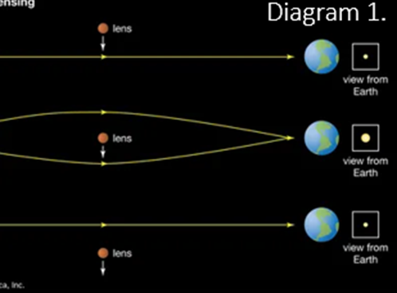
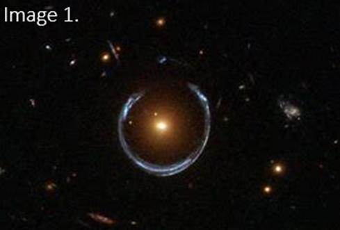

No matter who you are, it is a universal dream to explore and experience new planets, exotic atmospheres, and alien scenes but is that really something we can do? The rapid pace at which technology is evolving is bringing forth the possibility of daily space travel, which earlier seemed to be a distant fantasy. This rate of development, with the aid of continuous innovation from private firms within the industry, raises the question of how long will we have to wait before star systems become within our grasp?

The viability of eventually traversing exoplanets, planets outside our solar system, relies on two main factors – our ability to detect them and proficiency in discovering the climate on these planets to test for their habitability. The second of these factors is made much easier once the first is tackled. 

The easiest way to detect an exoplanet would just be to observe it. However, this is much more difficult than it first seems since we are able to perceive objects due to light reflecting off them. In the case of exoplanets, regardless of whether an atmosphere is present that reflects an abundance of light, the light that is reflected by the exoplanet will be overwhelmed by the light being emitted by the host star. It is analogous to holding a candle in front of stadium lights; although the flame is there, you cannot see it as it is inundated by the luminosity of the floodlights. As a result, we must explore three other methods for detecting and classifying exoplanets: Radial velocity, transits, and gravitational microlensing.

The radial velocity method is one of the simplest and relies on the interaction of gravitational fields, irrespective of the masses present. You may recall that every object with a mass is accompanied with a gravitational field and the heavier the object, the stronger the gravitational field. Therefore, a planet also has a gravitational effect on its star despite being a miniscule one. This causes a wobbling of the star and can in turn be used to detect exoplanets. Due to this wobble being more pronounced the closer a planet is and the larger the mass of the planet. 

This method is most easily used on millisecond pulsars which are a special type of star formed from the remnants of a supernova and very dense and very radioactive so even if there are planets here, they are never going to be habitable. What is special about millisecond pulsars is that they release exact periodic pulses of radio waves which can be measured from Earth and plotted against time. If there exists a planet in orbit around a millisecond pulsar then it causes the pulses, every so often, to be offbeat.

This ‘offbeat’ pulse is regularly repeated thus giving astronomers the value of the period of the orbit the planet has around the pulsar. Using this and formula 1, you can calculate the radius of the orbit of the planet.

‘r’ is the radius of orbit
‘G’ is Newton’s gravitational constant 
‘M_*’ is the mass of the host star 
‘P’ is the time period of orbit

If the mass of the planet is also known, then we can calculate the velocity of the star, v_*, (Formula 2).

in addition to the radius of orbit of the star, r_*, (Formula 3) around the shared centre of the mass of the system.

However, there are some drawbacks to this method; most notably, it must be done on millisecond pulsars otherwise the observation time of the pulses will need to be over years rather than days or weeks. Secondly, if we are trying to find habitable planets then this is completely the wrong place to look as no life would survive under the harsh radioactive conditions. Thirdly, even if a planet is very close in, it produces a very small wobble so any planet further out, maybe in the goldilocks zone (a region of orbit around a star where it is possible for liquid water to exist), will not be detectable with this method as the wobble just would not be distinguishable. Fourthly, the planets found using this method are almost always hot Jupiters as they are both close in and are ‘massive’. A hot Jupiter is a Jupiter-sized planet, which could be rocky or gaseous that is very close to its host star hence it is hot. Finally, using this method we have no way to prove that what we are measuring the effects of is a planet or if it is a dwarf star in a binary system with the pulsar. To prove that it is in fact a planet we need to know both its mass and density, we have mass but to find density we must use the next method, transit.

Transits are events that happen when an exoplanet passes in front of its host star relative to us. This leads to a slight dimming in the light that reaches us. Once per orbit, this dip can be measured to find the radius of the planet, r_p, where B is the normal brightness of the star, ∆B is the change in brightness and r_* is the radius of the star. 
Using formula 1  we can also calculate the radius of orbit of the planet. Most importantly, we can find the density of the planet using both its mass and radius and verify that it is an exoplanet and not a dwarf star. 

We can take this technique further to work out what the planet is made of as well, firstly by calculating its temperature, T, using the following equation (‘L’ is luminosity, ‘D’ is the diameter of the planet and ‘σ’ is the Stephan-Boltzmann constant in Formula 5) and also performing a spectroscopy on the light reflected by the planet; you can match the emission patterns to known chemicals and materials to gain a deeper insight into perhaps what it would look like on the surface.

Due to the following reasons, the spectroscopy must be done at specific times during the planet’s orbit.  For every transit there exists a secondary transit, which happens when the planet is behind the star and a secondary dip in brightness is observed. This is due to the fact that a planet is reflective so at every point except when the planet is behind the star it is also contributing very slightly to the light that reaches us. A graph of flux (a measure of brightness) against time is shown below:

Secondary transits are very difficult to do as the change in brightness is miniscule and indistinguishable from atmospheric disturbance in telescopes on Earth. Which is why space telescopes such as Hubble and Spitzer are used, recently the James Webb was also added to the fleet. 

By subtracting a spectrum taken during the secondary transit from one taken just out of the secondary transit, the spectrum of the day side of the planet can be obtained and thus planets like J1719-1438 can be discovered. This planet also dubbed as the ‘diamond planet’ has around the mass of Jupiter but has the size of a core of a dwarf star, this extreme density causes massive pressures on the mostly carbon surface turning it into diamonds. Even though many planets have been discovered by Kepler, Spritzer, Hubble and many more using this method, they all have one flaw that is shared with the planets discovered using radial velocity measurements; almost all of them are hot Jupiters and if not then they are just extremely hot rocky planets. To help solve this and allow us to ‘see’ more Earth-like planets, we need to employ the phenomenon of gravitational microlensing.

Gravity, although the weakest of the four fundamental forces, can bend light by bending the fabric of space-time. In this way, when we look at a very distant object such as the bulge at the centre of our galaxy, and a massive object comes in between (for the sake of this explanation let’s say it comes directly halfway in between) our line of sight, it distorts the image we perceive. This very effect is called gravitational microlensing and has been demonstrated in the example below. 

Diagram 1 shows a singular ray of light from the focus (the bulge at the centre of the galaxy) as it is bent around the lens star leading to an increase in brightness of the image. 

If we instead look at every ray rather than singular ones, we see something like image 1:

Since we know what the focus image behind the lens looks like ‘normally’, we are able to reverse engineer a lens shape to fit the scenario. The lens is what we are interested in as there are distinct patterns that emerge if the lens is just a lone star versus if it has a planet in its orbit. This is a very powerful, although rare, tool because we now have a way to detect the previously elusive ‘non-Hot Jupiters’ also known as Super-Earths or Mini-Neptunes which lie further out from the star. What seems to be microlensing’s Achilles heel is the fact that it is a very rare event so while it may be our ace method, it is unreliable. 

In conclusion, I think the idea of human beings leaving our solar system is currently absurd and will be for many hundreds of years mostly because, evident to this article, we wouldn’t know where to go. There are many theoretical models for space travel but all of them focus on the journey rather than the end point, if we cannot find perfectly habitable planets close to us then I think it is a waste of resources to experiment ways to get there. It is much more prudent for Mars and Venus to be our top priority. On the other hand, we as a species are very adept at accelerating scientific progress at the cost of our planet, so who is to say we won’t breakthrough again to find Earth 2.0.

## Bibliography
- All graphs and equations come from the exoplanets course; [Course | Astrophysics: Exploring Exoplanets | edX](https://learning.edx.org/course/course-v1:ANUx+ANU-ASTRO2x+2T2020/home)
- Diagram 1; [gravitational microlensing | astronomy | Britannica](https://www.britannica.com/science/gravitational-microlensing)
- Image 1; [A Horseshoe Einstein Ring from Hubble - Gravitational microlensing - Wikipedia](https://en.wikipedia.org/wiki/Gravitational_microlensing#/media/File:A_Horseshoe_Einstein_Ring_from_Hubble.JPG)
