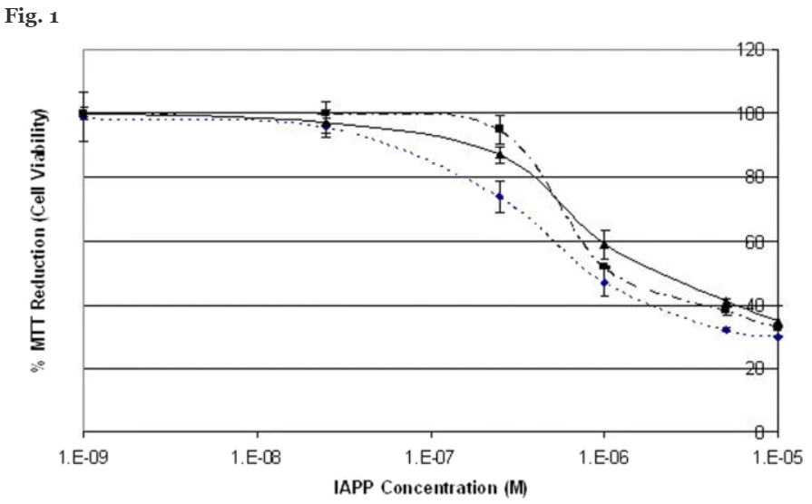

## Results

To investigate the effect of human IAPP on rat Rin-5F cells, MTT assays were carried out, as they reliably report on cell viability via changes in metabolic activity. The cells were treated initially with different concentrations of IAPP (ranging from 10 μM to 1 nM) for 24 h. Monomers and oligomers of IAPP are known to cross the plasma membrane through both endocytotic and non-endocytotic mechanisms in these cells [23]. The viability of Rin-5F cells was reduced with IAPP concentrations from 10 μM to 250 nM (Fig. 1), though there was little change above 5 μM. Addition of DMSO at the same concentrations had no effect on viability (not shown), showing that loss of viability is solely due to IAPP. 5 μM IAPP was therefore used for subsequent work, as the minimal concentration that gives a large change in cell viability. An MTT assay at 5 μM was then carried out to identify the optimal time points at which the IAPP cytotoxicity effect had the largest effect on Rin5F cells’ viability (Fig. 2). The cells’ viability was sharply reduced 2 h after the addition of IAPP and did not change significantly between 2 h to 32 h, after which the MTT signal increased slightly. The 5 μM IAPP concentration with an exposure time of 24 h was therefore used for further experiments. In Rin5F cells, 10 μM IAPP causes less than 20% cell death, whilst 20 μM is required for complete cell death [24]. This conclusion is not dependent on using MTT, as other toxicity assays (e.g. live/dead) show the same result [25]. A concentration of 10 μM is typically used to induce apoptosis [26, 27]. Effects of IAPP on the cells under our conditions will therefore show damaging effects of IAPP before the onset of apoptosis.

We used OFFGEL™ proteomics to study how IAPP exposure affects the proteome of rat pancreatic insulinoma Rin-5F cells. The OFFGEL™ methodology is highly effective at generating quantitative data on hundreds of proteins affected by IAPP, with its accuracy confirmed by In Cell Western and Quantitative Real Time PCR results. Combining data on individual proteins identifies pathways and protein complexes affected by IAPP. IAPP disrupts protein synthesis and degradation, and induces oxidative stress. It causes decreases in protein transport and localization. IAPP disrupts the regulation of ubiquitin-dependent protein degradation and increases catabolic processes. IAPP causes decreases in protein transport and localization, and affects the cytoskeleton, DNA repair and oxidative stress.

## Conclusions

Results are consistent with a model where IAPP aggregates overwhelm the ability of a cell to degrade proteins via the ubiquitin system. Ultimately this leads to apoptosis. IAPP aggregates may be also toxic to the cell by causing oxidative stress, leading to DNA damage or by decreasing protein transport. The reversal of any of these effects, perhaps by targeting proteins which alter in response to IAPP, may be beneficial for type II diabetes.
