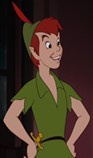
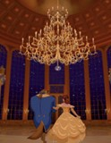
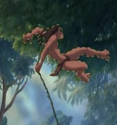
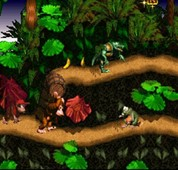

Animating in 2.5D (2.5 dimensional) is a fairly common technique in the industry - with it being used in entertainment ranging from our beloved Disney classics to video games. We know that 2D is a visual technique in which the images, characters and sprites are flat, whereas 3D computer graphics (aka CGI - computer generated images) make the digital object seem as though it is moving in three-dimensional space. So what is 2.5D? 

It is, as the name would suggest, a combination of the two techniques - animators would mix 2D elements with 3D ones such as a 3D environment setting + a 2D character moving through it or even a 3D simulation that is then ultimately hand-drawn and made 2D.

    
          
        

        
2D Peter Pan
  
    

    

        

        
3D Raya and the last dragon

    

    

        

        
2.5D Beauty and the Beast

    

    

        

        
2.5D Paper Mario
 
    

    
There has been a lot of controversial development in the animation industry over the years - the rise of 3D animation being seen as a replacement for nostalgic 2D films like Bambi (1942) - however 2.5D films pose a solution to the never-ending debate. This concoction seems to possess the fantastic details and lighting from CGI with the seal of a traditional hand-drawn feel. There are certain aspects that computers simply can’t replace such as the ‘comic strip’-like sensation depicted on the left.

    

</img>

    

</img>

    
Mixing animation styles is not a new concept and is quite prevalent in successful, modern day films such as Sony’s Spider-Man: Into the Spider-Verse (2018) and Disney’s Chip ‘n Dale: Rescue Rangers (2022), as well as believe-it-or-not The Lion King (1994) and Tarzan (1999). Probing further into the last two, 3D techniques were often used to simulate a large movement or environment, e.g. the wildebeest stampede scene in The Lion King, whilst the entire Tarzan jungle was created in 3D with a hand drawn Tarzan swinging through. The pioneering computer animation software they used at the time for this effect was Deep Canvas.

In fact, the Oscar-nominated Apple TV film “Wolf-walkers” (2020) used 3D models and VR to create a CGI forest much like Tarzan. However, the animators took this one step further and recreated each scene by hand, using graphite on thousands of sheets of paper - to mimic art from the 1600s. Ultimately, 2.5D serves as an in-between medium to make use of the best of both worlds. “The idea was that it would not feel too clinical, too clean, too artificial,” says Eimhin McNamara, an animator at Cartoon Saloon - which produced Wolf-walkers. He also shares that “it helps you feel like you're actually in the head of the character.” To help with the time-consuming process, they played with the frame rate - dropping it down from 24 fps (frames-per-second) to 12 fps, meaning they drew 12 images for every second. Still a very painstaking task if you ask me!

    
Talking more about the video games side of things, pseudo 3D games first came about in arcades in the mid-1970s. ‘Interceptor’, a combat flight simulator game by Taito, was supposedly the first arcade game to make use of 2.5D with its “eight-way directional movement, shooting down enemy planes, and depth perception by size-changing enemy planes.” Moving further in time, we find more titles such as Donkey Kong Country, which features 3D characters and backgrounds, but with restricted 2D plane movement - ending up as a 2.5D game.

    

</img>

    

</img>

    
There is however, a key difference between 2.5D used in games and in films. In video games, this technique is used more often by playing with perspectives. An isometric view, such as the one depicted on the right, gives the illusion of 2D characters being shown as 3D. Nevertheless, like Donkey Kong Country, the side-scrolling 2D plane movement makes games like these in 2.5D perspective. The reason for using this technique was initially to do with limitations of the hardware systems - e.g. generating full 3D games required a lot more power than a NES could provide at the time. Nowadays, much like with films, it’s a choice made for the realism and in-depth, immersive feel you get from a 3D-style.

In conclusion, 2.5D is a relatively generic term that describes a combination of animation styles used in making films and video games or an illusion of 2D and 3D. In fact, most of the entertainment that you usually consume is in fact in 2.5D - you just didn’t know it! Keep an eye out for it next time you watch a Netflix movie thinking it’s entirely either 2D or 3D, looks can be deceiving…

<h2>Bibliography:</h2>

- https://www.insider.com/how-wolfwalkers-used-3d-tech-to-transform-25d-animation-2021-2#:~:text=But%20many%20films%20actually%20fall,a%20unique%20hand%2Ddrawn%20style.</li>
- https://mangaplanet.com/what-is-25d/</li>
- https://www.bullfrag.com/what-are-2-5d-games-and-how-do-they-work/</li>
- https://www.makeuseof.com/what-are-2-5d-games-2d-3d/</li>

