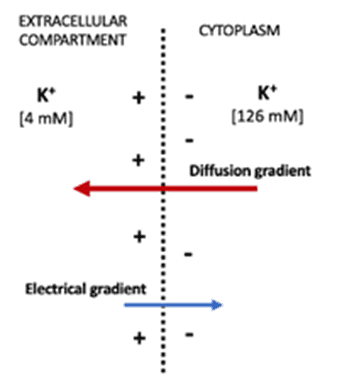

In this article, we will be discussing the fundamentals of electrical signalling in the body. Electricity is required for the nervous system to send signals throughout the body and to the brain, making it possible for us to move, think and feel. This is only possible through our nervous systems and the use of neurons and action potentials.

In the early nineteenth century, the nature of electricity remained vague to scientists. The history of bioelectricity began in 18th century Bologna, Italy when scientist Luigi Galvani was dissecting a frog [1]. As his assistant touched a nerve in the frog's leg with a metal scalpel, he noticed that it picked up static charge causing the frog's leg to move. Later another scientist called Alessandro Volta repeated Galvani’s experiments [2], but doubted the existence of an electric fluid intrinsic to animals. Further research led to him developing the first battery, proving that electricity could be generated outside of a living creature. Today, galvanism is known as the electrical phenomena in living beings.

Firstly, in order to understand the basics we have to be aware of what a neuron is. A typical neuron contains a cell body and some which houses the cell’s nucleus and a variety of cellular machinery. It also consists of axons and dendrites extending out as well as an outer layer which is composed of a bilayer of lipid molecules that partition the inside of a cell from the outside. This is known as the cell membrane.  

Let’s start with the resting potential. When a cell is at rest, it is not electrically neutral. A small voltage is measured known as the membrane potential, which calculates to around 70 millivolts. The membrane potential of a neuron that is specifically “at rest” means that it is not sending or receiving signals. Another term we should be familiar with is the membrane potential. This is a general term that describes the voltage across the membrane. At any point in time, the membrane potential of a neuron can vary widely for example from -90mv to +60mv.

## Equilibrium potentials
Now that we have visited resting and membrane potentials we shall introduce equilibrium potentials. The equilibrium potential is the electrical potential difference across the cell membrane that exactly balances the concentration gradient for an ion. 
Consider the case for a single ion. Movement of charged ions through a semipermeable membrane is governed by two forces: the concentration gradient (a difference in concentration) and the electrostatic gradient (an electrical potential difference). As ions move, the concentration gradient that drives movement decreases while the electrostatic gradient that opposes movement increases. This means that an equilibrium will always be reached where the concentration gradient is exactly equal and opposite to the electrostatic gradient. At this point, the electrostatic gradient is known as the equilibrium potential.

    

</img>

    <em>This figure shows the movements of potassium ions across a cellular membrane- potassium ions leave the cell according to its concentration gradient, however this is accompanied by the movement of potassium ions into the cell as they are attracted towards the increasingly negative intracellular environment [3].</em>

Several factors influence this equilibrium potential: the concentration of ions on both sides of the membrane (concentration gradient), temperature (increases the effect of the concentration gradient), and the charge of ions (increases the effect of voltage).  To maintain stable concentrations of both sodium and potassium, a sodium potassium pump is essential to maintain high intracellular potassium and high extracellular sodium. This pump actively transports potassium and sodium against their concentration gradients; this allows the concentration gradient that these ions travel down to be maintained and therefore, for the resting membrane potential to be maintained. You may have heard of the sodium potassium pump from your studies in Biology at GCSE and A Level, an example of active transport.

## The Action Potential 
Now that we have visited equilibrium potentials, it is time to consider action potentials. Action potentials occur when a neuron sends information down an axon away from the cell body. Neuroscientists use words such as spikes or impulses for the action potential as it is known as an explosion of electrical activity that is created by a depolarising current. 

Embedded in the membranes, channels change in response to their local environment, opening and closing at any given moment depending on their local membrane potential. Complex molecular machines are made from proteins. As voltage changes, the conformation of the protein shifts either opening and closing the pore of the channel, hence they are known as voltage-gated.

<em>This figure [4] shows the stages of the action potential, explained below.</em>

The action potential can be broken down into a few stages. The first stage begins with the activation of the action potential, during which a few Na+ channels open causing depolarisation to reach threshold potential (the potential when the inward Na+ current balances the outward K+ current). When this threshold potential is exceeded, an action potential can be generated. The second stage is when depolarisation is sensed by voltage gated Na+ channels which activate and allow Na+ in, causing the cell to depolarise further. Therefore, a positive feedback loop is set up as depolarisation leads to more voltage gated Na+ channels opening, leading to more depolarisation.

Following this, all Na+ channels open and the membrane potential approaches ENa; the membrane becomes more permeable to Na than K. At 40mv, Na+ channels shut automatically. It is important to realise that during this period, K+ channels have been slowly opening, allowing the positive charge out. K+ channels are voltage gated too but open slowly in response to depolarisation. 
After this, it follows that repolarisation occurs as K+ channels allow K+ efflux and Na+ channels are shut, bringing the membrane potential back towards Ek. Finally, some K+ channels close and the membrane stabilises at the resting membrane potential. 

However, the potential overshoots the resting level because K+ channels are also slow to close again on repolarisation. This is the hyperpolarisation period as the membrane potential is more negative than the resting potential. 
So, what’s happening is that a negative feedback loop is taking place: depolarisation leads to an increase in permeability to K+ leading to an increase in K+ out, repolarising to counter depolarisation. 

## Propagation of the action potential
How are action potentials propagated? Action potentials are propagated by local currents along the membrane that change the voltage of neighbouring regions. When depolarisation occurs at one region of the axon, the current generated travels passively along the axon. Using our knowledge of the action potential, this spread of current depolarises adjacent regions of the membrane, opening some Na+ channels in the adjacent membrane. If the current is large enough, the depolarisation of the adjacent region will be large enough to exceed threshold potential. A positive feedback loop is set up leading to full depolarisation and initiating an action potential in the adjacent membrane regions. The depolarisation in turn generates currents which spread and depolarise the neighbouring region of membrane, and the cycle repeats. Eventually the signal travels down the axon and generates an action potential at the opposite end of the axon. 

Another important question to ask is how are action potentials propagated in one direction? The absolute refractory period occurs when Na+ channels are inactivated after they have just closed and will not open regardless of membrane potential and depolarisation, the Na+ channel will return to its active state after a period of time, ready to be activated when the membrane is depolarised. The relative refractory period occurs when the threshold potential is raised due to the reduced availability of active Na+ channels. Only some Na+ channels can be activated, thus a greater depolarisation is needed to generate a large enough inward Na+ current to balance the outward K+ current for threshold potential.

These refractory periods allow the conduction of action potential in a singular direction. An action potential cannot be propagated backwards, only forwards. When an action potential is generated, the current generated can cause depolarisation of both the upstream and downstream adjacent regions. However as the upstream region will still be in a refractory period it is impossible or more difficult for an action potential to be generated due to the lack of Na+ channels available for activation. 

Similar in effect to the relative refractory period, K+ channels may still be open from the previous action potential in the upstream region. Thus the outward K+ current opposes the depolarisation experienced, reducing the effect of the Na+ current on membrane potential. The membrane upstream may still be hyperpolarised, so a much larger current is needed to bring the membrane potential up to the threshold potential. 

Overall the action potential generated is much more likely to only initiate another one in the downstream region where it is not in refractory period and the membrane is at resting potential. Na+ channels are active and ready to be activated. In this way, there is a one way propagation of the action potential down the axon!

## The length constant
An important consideration when it comes to action potentials is the length constant. 
The axoplasm has a high resistance, longitudinal resistance along the axon is too high. In contrast, cell membranes are poor resistors, and as a result transmembrane resistance across the membrane is too low. The result is that electrical current generated during an action potential leaks out of the axon as it travels through the axoplasm.This means voltage decays with distance from the action potential where initial depolarisation occurred. We define the length constant as the distance needed for the voltage to decrease to 37% of the initial voltage from the action potential. This describes the extent of leakage. In human axons the length constants are very small. Therefore the passive spread of current is unable to carry information over large distances. 

This is the very reason why action potentials exist and need to be constantly generated along the axon to allow for constant injection of currents so the signal (an action potential) can travel from one end of the axon to the other. An action potential also has to be propagated by a series of currents!

## How can we speed up propagation of an action potential?
What affects the speed of propagation of an action potential? One logical way of speeding up propagation and making action potentials faster would be increasing the density of sodium channels. More channels represents a lower resistance and more current. But this is metabolically expensive as more sodium will need to be pumped out of the cell to active the action potential. What about increasing the length constant? This would allow currents to spread further along the axon; regions further from the active regions can be brought to threshold by passive current flow, speeding up the action potential. In theory, this could be done by decreasing longitudinal resistance or increasing transmembrane resistance. However, the things that determine longitudinal resistance (width and length of nerve and the intrinsic ionic composition of the nerve fibre itself) are not easy to change and are already optimised. 

A particularly well known adaptation of neurons is myelination- axons are wrapped repeatedly around by schwann cells (in PNS) or by oligodendrocytes (in CNS),  covering the axons with concentric layers of myelin. The myelin sheath increases transmembrane resistance, increasing the length constant. Thus less current can leak through the membrane and voltage decays less rapidly.  It is important to note that myelination increases length constant but does not change the intrinsic longitudinal resistance of the nerve itself. 

An additional note is that small-diameter myelinated nerve fibres conduct action potentials slower than unmyelinated fibres. This is because the axon of the myelinated fibre is too narrow causing the longitudinal resistance to be too great to conduct action potentials effectively. Hence small nerve fibres e.g. pain fibres are unmyelinated.

<h2>Bibliography</h2>

1. Anon, Luigi Galvani. Encyclopædia Britannica. Available at: https://www.britannica.com/biography/Luigi-Galvani [Accessed August 31, 2022]. 
2. Anon, Experiment: the beginning of modern neuroscience - the Galvani/Volta debate. Available at: https://backyardbrains.com/experiments/Galvani_Volta [Accessed August 31, 2022]. 
3. Anon, 2021. Resting membrane potential - nernst - generation. TeachMePhysiology. Available at: https://teachmephysiology.com/nervous-system/synapses/resting-membrane-potential/ [Accessed August 31, 2022]. 
4. MD, J.V., 2022. Action potential. Kenhub. Available at: https://www.kenhub.com/en/library/anatomy/action-potential [Accessed August 31, 2022]. 
5. Fullick, A., Bircher, P. & Locke, J., 2015. A level biology for OCR a year 2, Oxford: Oxford University Press

