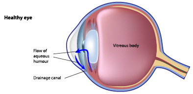
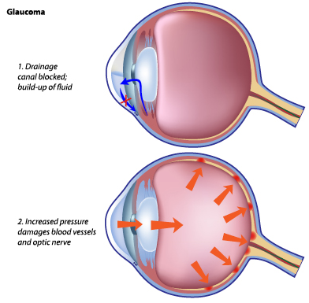
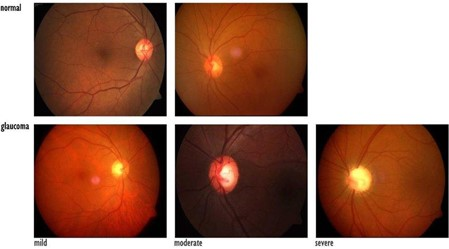

## 1. Introduction
Recent advances in medicine have led to the development of numerous devices that aid the detection of eye conditions such as glaucoma, macular degeneration and cataracts which are amongst the causes of reduced vision or even irreversible blindness. With age as the largest risk factor for most of the aforementioned conditions, screening the elderly at higher risk has become a common practice in the UK, allowing early detection and thus reducing complications or blindness.  

As mentioned by Glaucoma UK [1], glaucoma is the leading cause of blindness affecting over 700, 000 people in the UK of all ages. It is a chronic, neurodegenerative disease and is defined as the loss of retinal ganglion cells in the optic nerve of the eye, resulting in progressive loss of peripheral vision. The damage to the optic nerve head is due to elevated intraocular pressure (IOP) as a result of unevenness between the production of aqueous humour (transparent fluid located in the eye) and the drainage system of the eye. 

## 2. Development of Glaucoma
The aqueous humour, as shown in Figure 1, provides nutrients to the eye and maintains the eye pressure. It is produced by the ciliary body and flows to the anterior chamber where it is drained at the drainage angle. The reference of ‘angle’ is the angle between the cornea and iris. Amongst the various structures of the drainage angle, the most essential structure in the drainage of aqueous humour is the trabecular meshwork which is a spongy tissue with a sieve-like structure.
 

<em>Figure 1 – Taken From Medirex Opticians [8]</em>

Following fluid drainage from the eye via the trabecular meshwork, the fluid flows through a structure called the Schlemm’s canal, into collector channels, veins and then eventually, back into the body’s circulatory system [3].

A blockage in the drainage system restricts the flow of aqueous humour into the anterior chamber, resulting in increased pressure in the eye and eventually damaging the optic nerve. The optic nerve (also known as second cranial nerve) found at the back of the eye transfers visual information from the retina to the brain via electrical impulses [2]. The high pressure caused by inefficient drainage compresses the second cranial nerve resulting in cell death – this is called Glaucomatous optic atrophy. If left untreated or undetected, this can lead to irreversible blindness.

<em>Figure 2 – Development Of Glaucoma Taken From Medirex Opticians [8]</em>

Recent research in Singapore has led to the discovery of a gene mutation linked to exfoliation syndrome (XFS), which is known to be the basis of secondary glaucoma [7]. If an individual has XFS, fibre-like substances existing outside of cells are deposited on ocular structures and throughout the body. The exact reason for XFS is unknown and hence, the mystery surrounding it means that the ultimate cause of glaucoma is still to be concluded. 

## 3. Classifications of Glaucoma
There are several types of glaucoma, some include:
- Juvenile/adult Primary open-angle glaucoma 
- Acute-angle closure glaucoma
- Secondary glaucoma
- Congenital glaucoma
The most common type of glaucoma is primary open angle glaucoma (POAG). Anyone can develop POAG but there are some risk factors that may make individuals more susceptible to it. These include:
- Age
    - According to Glaucoma UK [6], it is estimated that about 2% of people aged 40+ have POAG, and this rises to almost 10% in people older than 75 (Glaucoma UK, n.d.). 
- Ethnicity
    - Individuals with an African – Caribbean origin are at a higher risk of developing POAG compared to an individual with a European origin
- Family History
    - If your parents or sibling suffer from glaucoma, you are at a higher risk of developing POAG
- Myopia
- Corneal thickness

Like most types of glaucoma, fluid is unable to be drained which leads to an increased eye pressure, damaging the second cranial nerve. Nevertheless, in POAG, a subgroup known as normal tension glaucoma (NTG), where the eye pressure is not very high, still damages the second cranial nerve. This may also be referred to as low tension glaucoma. Unlike most eye diseases, glaucoma does not show symptoms in early stages as there is no pain or drastic change in vision since the damage occurs in the peripheral parts of the vision. 

As mentioned, glaucoma left undetected can lead to devastating consequences such as irreversible blindness. So how can glaucoma be detected? 

## 4. Detection of Glaucoma
After years of research and developments, there are now several modern computer-based machines that can be used to detect early signs of glaucoma. Some include the optical coherence tomography (OCT) machine and the fundoscopy machine. 

The OCT machine is a high-resolution imaging modality producing a cross-sectional tomographic (3-dimensional) image of the retina and evaluates the optic nerve. The use of long-wavelength and broad-bandwidth light sources to illuminate the retina enables it to assess the light reflected from the retinal tissues through the use of a spectrometer [4]. Additionally, it can indicate small changes in the thickness of the nerve fibre layers which gives early signs of glaucoma. Other than glaucoma, the OCT machine can also detect age-related macular degeneration (AMD), diabetic macular oedema (DME), central serous chorioretinopathy (CSR) and many more diseases. A low image quality can often be caused by cataracts due to the blockage of light.  

In addition to the OCT machine, a fundoscopy machine can also be used to detect glaucoma. Like the OCT machine, it is a modern medical imaging technique that enables optometrists or ophthalmologists to detect changes in the optic disc and hence, glaucoma. 
 

<em>Figure 3 – Fundoscopy Pictures From Hindawi Journal Comparing Optic Disc Without and With Glaucoma [5]</em>

## 5. Treatment of Glaucoma
Although there are no available treatments to regain vision that has been lost, eye drops such as betaxolol hydrochloride (Betoptic S) and metipranolol (Optipranolol) have been made available to those suffering from glaucoma. These are beta blockers which reduces the production of fluid released from the eye. Prostaglandins such as latanoprost (Xalatan) are other forms of eye drops that improve the drainage of the fluid in the eye to reduce ocular hypertension. Other forms of treatments include laser procedures and surgery. Nevertheless, there is still room for further developments of treatments such as gene therapies to prevent more prevalent ocular diseases such as POAG and its eventual testing in humans. Despite ongoing research on how gene therapies may prevent POAG, Luxturna, a form of gene therapy, has been known to treat congenital blindness (another classification of glaucoma) which is a seminal accomplishment.

## 6. Conclusion
Having said that, it is important to remember that these non-invasive treatments do not cure glaucoma, but instead it controls the intraocular pressure in the eye and prevents damage to the optic nerve. Hence it is vital to regularly attend eye check-ups, especially with a family history of glaucoma or other eye conditions. 

Don’t forget: Prevention is better than cure. 

<h2>7. Bibliography</h2>

(1)	Glaucoma Information. (2018). Drainage system of the eye. [online] Available at: https://www.glaucomapatients.org/basic/drainage-system/ [Accessed 1 Aug. 2022].

(2)	Healthline. (n.d.). Optic Nerve Function, Anatomy & Definition | Body Maps. [online] Available at: https://www.healthline.com/human-body-maps/optic-nerve [Accessed 4 Aug. 2022].

(3)	BrightFocus Foundation. (2016). Glaucoma and the Importance of the Eye’s Drainage System. [online] Available at: https://www.brightfocus.org/glaucoma/article/glaucoma-and-importance-eyes-drainage-system [Accessed 5 Aug. 2022].

(4)	American Academy of Ophthalmology. (2019). OCT: How It Works and When to Use It. [online] Available at: https://www.aao.org/young-ophthalmologists/yo-info/article/oct-how-it-works-and-when-to-use-it [Accessed 8 Aug. 2022].

(5)	An, G., Omodaka, K., Hashimoto, K., Tsuda, S., Shiga, Y., Takada, N., Kikawa, T., Yokota, H., Akiba, M. and Nakazawa, T. (2019). Glaucoma Diagnosis with Machine Learning Based on Optical Coherence Tomography and Color Fundus Images. [online] Journal of Healthcare Engineering. Available at: https://www.hindawi.com/journals/jhe/2019/4061313/.

(6)	Glaucoma UK. (n.d.). Primary Glaucomas | About. [online] Available at: https://glaucoma.uk/about-glaucoma/what-is-glaucoma/primary-glaucoma/ [Accessed 5 Aug. 2022].

(7)	Primera Eye Care (2021). Recent Study Finds Glaucoma Linked to a Gene Mutation. [online] Primera Eye Care | Lake Mary Optometrist. Available at: https://primeraeyecare.com/glaucoma-gene-mutation/ [Accessed 11 Aug. 2022].

(8)	Medirex Opticians. (n.d.). Medirex Opticians. [online] Available at: https://www.medirex.co.uk/glaucoma/ [Accessed 12 Aug. 2022].

