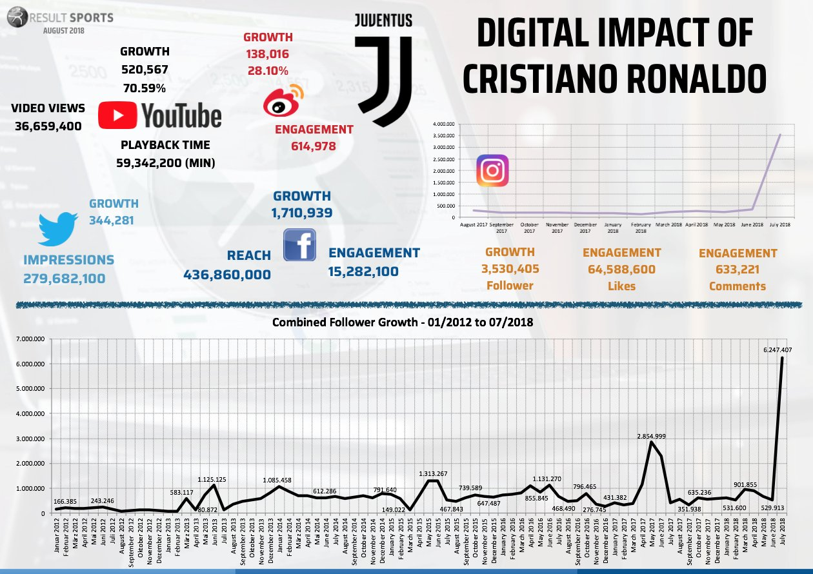

Since 2014, with all factors being equal, the annual inflation growth rate on the transfer market for the top 5 league footballers has been 26%. Reports also show that with respect to 2011, the same player costs almost three times more1, but why?

The expensive nature of transfers originates from the marginal value of the very best football players being immense. Considering that football has risen to become the most popular sport in the world, the returns that these players can generate to their respective clubs is massive. 

</img>

Looking from a football teams’ perspective, there are 4 main revenue streams: sales from match days (tickets, food and associated merchandise), commercial sales (shirt sales) and revenue from TV licences. For most large clubs, match day sales are mostly fixed with little fluctuation since they sell out most to all their stadium. On the other hand, the other 3 factors are massively dependent on the success of the team and their overall popularity. Sponsorships tend to also be driven by the reputation and success, where more notable and prestigious teams land higher value sponsorships; Liverpool FC’s deal with their defining sponsor Standard Chartered, a British bank, is rumoured to be worth around $59.2 million a year2. Commercial sales are a weird mix of popularity and success, for example Man United have recently been underperforming largely but have no doubt been constantly selling shirts and tickets due to strong fan loyalty. TV revenue is also determined by several ways differing by league/tournament, the Premier League for example determines the final allocation of TV money by league position, how many games were shown by the team and also by the pool of money generated from selling the rights domestically and overseas.

Overall, 3 of these income streams can be maximised by having the best possible team and players. Franchise players can significantly help considering that many of these players come from countries with a large domestic market or fanbase; in 2019 Juventus signed Ronaldo for a fee of approximately £105 million, but his shirt sales alone reportedly earnt around $60 million in just the first 24 hours3 on top of the huge digital impact shown by the graph, proving how significant the ROI was associated with this transfer. It would be fair to expect the value of these franchise players to increase even further as more developing countries begin to participate more as global consumers of the games.

Another reason that accelerated increases in the value of transfers is due to a crazy transfer involving Neymar Jr, a Brazilian Prodigy. This all stems back to 2013, with Neymar joining Barcelona from Brazilian club Santos for a substantial but well reasonable fee of £49m4. Barcelona set his release clause at €222 million, which at the time seemed more than enough to put off any rational sporting investors, but PSG are not a rational club and in 2017 decided to break the transfer record by signing Neymar for this absurd fee. This sent the market for high tier football players into a vigorous spiral, with the first domino effects being seen in Spain where €1bn release clauses in renewed contracts have started to become more common with the top 4 teams. Desperate to replace Neymar with this huge sum of cash, Barcelona’s first mistake was to purchase Ousmane Dembele for €105 million from Dortmund where he was injury plagued and only scored 19 goals in 102 games. Disappointed with his performance, and also needing to replace Iniesta, Barcelona spent a further £120 million on Coutinho from Liverpool who performed even worse and ended up being loaned out. Within 6 months, all the money that Barcelona had received was gone, both players signed did not live up to expectations, causing it to anger fans and lead to substantially less revenue being generated compared to what was expected, whilst causing every other decent attacker’s value to be inflated by a huge margin, such as Joao Felix for £114 million and Jack Grealish for £110 million. There was also a surge in the number of free transfers; as more and more players were denied transfers to new clubs due to ridiculous valuations, many just started running down the time on their contracts and leaving like Pogba with Manchester United, Rudiger and Alaba with Real Madrid and Messi with PSG. 

In general, it has been much more common to see higher than ever price tags being slapped onto even the most mediocre of talents, but this is not surprising in a highly competitive industry with highly profit maximising clubs that will take every opportunity to squeeze money out of their rivals and fans. With more clubs seeing the potential of franchise players to help their finances and the fall of an old generation of players, there is even more demand for new football superstars for young fans to idolise, support and financially contribute towards as they grow up.

<h2>Bibliography</h2>

1.	https://football-observatory.com/IMG/sites/mr/mr47/en/
2.	https://www.sportspromedia.com/news/liverpool-standard-chartered-shirt-sponsorship-extension-premier-league/
3.	https://www.cnbc.com/2018/07/18/juventus-sold-over-60-million-of-ronaldo-jerseys-in-just-one-day.html
4.	https://www.bbc.co.uk/sport/football/22760770

