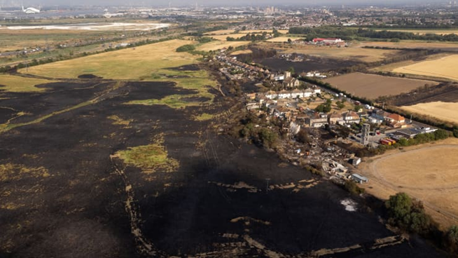
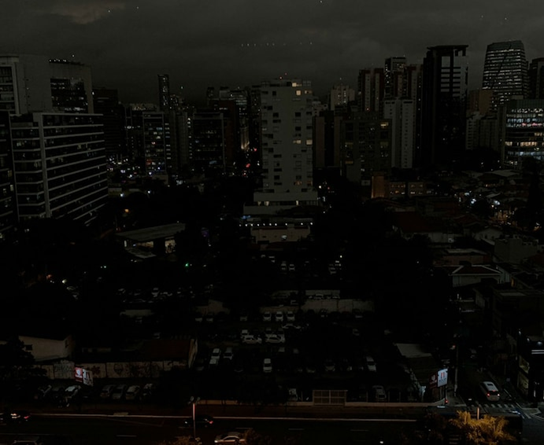
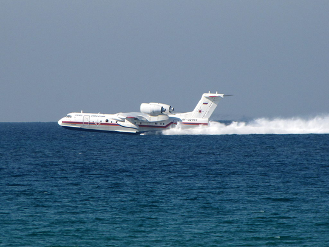
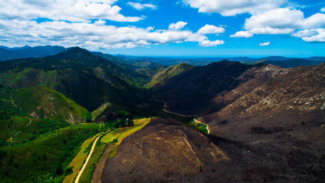

    
During the recent heatwave in Europe, fires broke out in various countries, such as the UK - where London saw “the busiest day for the fire service since WWII” - and France - where Bordeaux suffered multiple “monster” wildfires two months in a row, blazing through over 14,000 hectares in June and 7,000+ hectares in July.

    

        
</img>

        <em>Wennington, West London, after a grassfire in July 2021.</em>
    

Europe suffered through an event called a “heat dome,” which occurs when high pressure sits over an area for an extended period of time, trapping a warm air mass beneath it. High pressure pushes air to the surface, as it prevents it from rising, creating increased temperatures through compression. When sufficient levels of each have been reached, a fire starts. Unfortunately, a heat dome also causes drought, which dries up the grass and provides more than enough fuel for a fire to start. Finally, oxygen is needed to stoke the fire and cause it to grow. These three elements - heat, oxygen and fuel - form the fire triangle.

Something still needs to ignite the fire, however. Natural causes, such as lightning, sparks from rockfall, volcanic eruptions and spontaneous combustion, can all start wildfires. Wildfires have been natural occurrences for approximately 419 million years, and their presence has had evolutionary effects on most ecosystems’ plants and animals. Humans have also got ways of igniting fires, from sparks off machinery, power lines and trains, as well as people deliberately starting fires, either through arson, mistakes (like a smouldering cigarette or barbeque) or slash-and-burn (where a section of forest is razed to make way for construction). Preventing all these causes is futile, as there are far too many occurrences worldwide to stop them all, especially as a result of global warming, which makes the circumstances for fires more common, and increasing the amount of fires worldwide.

Perhaps the most interesting cause of ignition is spontaneous combustion. A flashpoint is when all three points of the fire triangle are present, and something ignites the fire. Flashpoints can be reached in other high-pressure, low water level areas too, such as compost bins, turning what was once innocuous into a ticking time bomb, should the temperature ever increase to the point where the compost bin self-ignites. In Canada, there is a common type of tree - the Ponderosa pine. The high sap content is an evolutionary advantage of the Ponderosa, as it allowed the tree to survive the fire season. However, global warming is increasing the temperature and causing the sap to evaporate. Without the liquid in the sap, the wood reaches a flashpoint and self-ignites.

When visiting Canada, on two occasions I was subject to some wildfires, likely caused by the Ponderosa pine self-igniting. Recently I drove through the small town of Lytton, which had been caught in the path of a fire and had burnt to the ground in 2021 - 90% of the town was destroyed, and over 2,000 people were affected. In Canada, most houses are constructed out of wood, due to their significant lumber industry, and Lytton was no different, facilitating the high destruction rate. The government had put barriers up to prevent onlookers, but through cracks I could see brown grass on black soil, and the outlines of roads and houses. Seeing the aftereffects of a wildfire was quite shocking, as most of the 6 hour drive north was accompanied by charred trunks and brown grass. At one point, I thought a mountain had snow on the top, which I thought was unlikely in July. I was corrected - the fires had burnt all the vegetation away, exposing the raw stone underneath.

The second time was significantly scarier. In 2017, Canada had one of its worst wildfire seasons in recent years, and I was right in the middle of one of these wildfires. Imagine looking out of the windscreen and seeing only 30 metres in front of you. With a few cats eyes on the road to guide us through the wall of smoke that reached so high the sky was tinged red due to all the light from the fire, it was difficult to see where to go, and our speed was reduced to a fraction of what it should be on a freeway. It was quite an experience, and the smoke from the fire reached all the way south to Vancouver, the largest city in British Columbia.

Now imagine how dangerous an undetectable fire could be. Detection methods on a large scale or in a rural area consist of firewatch towers and satellite images, which, naturally, cannot detect underground fires. Coal seam fires and root fires both travel, undetected, underground, for up to hundreds of miles. Fires may be put out on the surface, but can reappear days later when a root fire travels upward through a tree trunk or a coal seam fire comes too close to the surface. These kinds of fires are rare, but are inherently dangerous, as the short time to react means they can cause extreme damage, both short-term and long-term.

Starting by taking a look at the short-term effects, wildfires suck cold air down as hot air rises, due to the pressure differences created, which feeds the fire with oxygen and ensures it keeps going. This movement of air also creates wind, which can blow the fire at speeds of up to 6.7mph in dense forests and 14mph in grasslands, a danger for anything in the path, and sometimes outrunning evacuation efforts, as in Lytton, where sadly two inhabitants of the town died. The damages can prove costly, especially for weaker economies that cannot deal with the long-term rebuilding costs. The Lytton fire has cost US$150 million (as of October 2021), and the town is still not rebuilt, meaning the 2,000+ people affected are still displaced.

    

        
</img>

        <em>São Paulo, cloaked in smoke in 2019.</em>
    

    
Smoke is also an issue, both short and long-term. Short-term, it can lower visibility and prevent effective evacuation and medical assistance. In Canada, where distances are vast and terrain is vertical due to the Rocky Mountains, helicopters are used to rescue people trapped. However, smoke obscures vision and makes flight incredibly difficult. Smoke can be carried by the wind and blown many miles away, such as the August 2019 Amazon wildfires in Bolivia, where the wind carried smoke over 900 miles to São Paulo in Brazil, engulfing the city in darkness in the middle of the day.

The smoke also brought much lower air quality, affecting those with breathing problems especially badly, and lowered visibility to the point where basic travel became much more difficult to achieve, preventing people from going to work or visiting those affected by the smoke. If allowed to enter a building or other enclosed space, the smoke can also cause carbon monoxide poisoning too.

Smoke will clear after a short period of time, and houses can be rebuilt. Long-term effects are much trickier to deal with. Wildfires are a negative feedback loop - this means the effects from wildfires cause an increase in wildfires. Trees contain absorbed carbon from the atmosphere, and act as carbon sinks. They retain this carbon for years until they die, and a trees’ age is usually in the triple-digit range. When trees die, they release some of this carbon into the ground as it decomposes, and a small amount returns back to the atmosphere. When a tree burns in a wildfire, the carbon isn’t lost through decomposition. Instead, almost all of the absorbed carbon returns to the atmosphere. This helps the enhanced greenhouse effect, where gases like carbon dioxide trap heat from the Sun by scattering the rays and preventing some of the rays from reflecting off the Earth and going back out into space, increasing the temperature of the planet, and increasing the risk of wildfires.

WIldfires, naturally, cause environmental damage, especially when multiple bad wildfire seasons follow one another, leaving no time for the environment to recover. Given time, a habitat can spring back in just a few years, as plants have adapted to live with wildfires. Sequoia trees, for example, rely on fires to reduce competition for water, nutrients and sunlight, to release seeds from their cones and to clear the ground, ready for new growth. New growth cannot happen, however, if  the frequency of wildfires increases, preventing those species adapted to live with wildfires to deal with the increase in intensity and frequency caused by climate change. If plants that have adapted to live with fires can’t cope, the effect in areas with plants that haven’t adapted to deal with fires will leave longer-lasting damage. Climate change also increases the reach of wildfires, away from the equator and tropics, increasing the amount of regions that will experience fires. Most of Europe falls into this category.

So, how will Europe cope with this new threat? There are many ways to detect wildfires, and many ways to put them out, but few ways to prevent them.One of the few ways is to warn or ban ignition culprits like barbeques and smoking in wooded or grassy areas, as well as educating users of these spaces to the dangers of left-over smouldering litter. Detection methods are going to need to be adopted too. Large-scale methods like firewatch towers or satellite imagery are relatively simple to implement, but limited in their ability to detect smaller fires. They are also reactionary, meaning the fire will have had time to grow and spread before it is detected, which gives the fire a chance to grow larger or do some damage before it is noticed. Smaller-scale detection methods include remote sensors, which will be useful in high-value locations, such as population centres or wildlife preserves. This method can detect fires before they are given a chance to grow large and deal significant damage, but is costly to implement, limiting its large-scale effectiveness. Finally, weather data can be used to try and predict when wildfires have the highest chance of occurring, allowing wildfire detection methods to be put on high alert. However, as the recent heatwave has shown, changing weather over short periods of time can be exacerbated by climate change, changing rapidly from year to year, meaning estimates may not be as accurate as they would be otherwise and limiting the effectiveness of using weather data to make predictions. Additionally, due to this rapid changing, archival data is less accurate and prevents the accuracy of these predictions, as predictions are drawn from a smaller data set.

    
As wildfires prove inevitable in the face of difficult prevention methods and limited detection methods, effective methods of extinguishing the flames will be needed in the future. A common sight in wildfires, especially in countries with large areas of affected land, is the water bomber. These planes scoop up water from lakes and rivers, and drop them over the fires to extinguish them. Effective in rural locations and for large fires, but difficult to use if no water source is nearby and can create havoc if thousands of litres of water is dropped over an urban area. Their effectiveness in rural areas is due to their ability to hold up to 74,000 litres of water, although most bombers carry much less than the 747 Supertanker, which set the record for largest rated capacity in a water bomber. The Russian Beriyev Be-200, pictured below fighting fires in Israel in 2010, can carry 12,000 litres.

    

        
</img>

        <em>The Russian Beriev Be-200 heavy aircraft, fighting fires in Israel in 2010.</em>
    

    

        
</img>

        <em>A dirt road in South Africa stopping a wildfire from spreading.</em>
    

    
Other prevention methods exist, such as natural or man-made barriers. These generally consist of lakes, wide rivers, roads (generally motorways, although it can be smaller roads too) and areas of little vegetation. These barriers prove effective if wide enough and if the fire is small enough, however overhanging fauna or large fires can cross these barriers, making them only marginally effective. The most effective prevention method, especially in urban areas, are firefighters on the ground, who have been trained to deal with large-scale urban fires or wildfires. Combined efforts from the water bombers to extinguish large areas and firefighters on the ground to attack the smaller flames the plane did not catch are the best ways to deal with these large fires.

To recap, wildfires are increasing in range, frequency and are becoming more extreme. At the same time, we are becoming more able to detect and prevent the spread of wildfires, through new technologies, such as new prediction models based on simulated weather forecasts in the future, allowing us to be even more accurate in predicting when and where wildfires are most likely to occur.

Ultimately, if any lesson is to be learnt here, it's that wildfires are not to be taken lightly, and will continue to be a threat now and in the future, and we must learn to adapt and mitigate their effects as they change over time. Recently, one example of this is the European firefighters working together in Bordeaux to fight the ”monster” fires, sharing their knowledge as other countries that suffer from fires more frequently have deployed firefighters in France. This kind of coordination and teamwork is vital in adapting to cope with fires in areas where they have been absent until now, as it will become a more common occurrence as our world heats up due to climate change.
