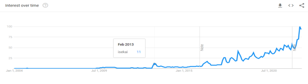

The isekai genre remains one of the most popular genres in web novels, light novels, manga and anime. As of August 2022, Anime Planet lists over 205 anime as having the isekai tag; over 1877 manga as having the isekai tag; and novel updates lists over 2100 light, web or published novels as having at least one of the following tags: transported to another world; transported into a game world; reincarnated in another world; and reincarnated in a game world.  The origin of the isekai can be traced to the Japanese folk tale of Urashima Tarō, who saves a turtle and is brought into a magical undersea kingdom. After spending what he thinks is 4-5 days there, he returns to his home, only to find that 300 years have passed1. That is what an isekai is: it is speculative fiction (fiction that incorporates elements not grounded in reality, recorded history or our universe) in which one or more protagonists are transported (usually through being summoned or dying and then reincarnating) into another world. From there anything can happen as the very nature of the setting allows the author to do whatever they want.  The term isekai itself (meaning “other world” or “different world” in Japanese) was used sporadically until 20132, after which a substantial increase in searches can be observed (see fig 1). 

<em>Fig 1. Google trends data showing frequency of the use of the term “isekai” in searches from 2004 with the data normalised to search frequency in July 2022. Frequency of use in July 2022 is arbitrarily set to 100.3</em>

With isekais having such a specific set of boxes they have to tick to be classed as an isekai, it is not surprising that Azuma Hiroki’s grand nonnarrative can be applied and can also be commonly seen in all modern, mainstream isekai. Azuma’s grand nonnarrative suggests that there is no grand narrative but instead all stories consist of tropes and clichés from a canonical pool of such recognisable to the reader. This collection of tropes and clichés is the so-called grand nonnarrative4. It is blindingly evident how this applies to modern isekai. After all, they all feature one or more protagonists being transported one way or another to another world or setting; a lot of them receive new skills or “cheat abilities” (read legally distinct plot armour); and usually there is magic and monsters. More niche tropes include the “game system” (where the world the story takes place has a system similar to that of role-playing games that has a level up mechanic etc); the death-by-truck-leads-to-reincarnation, which has spawned the meme of “truck-kun”; and more fantastical elements like the adventurers’ guild or the summoned protagonist(s) being chosen hero(es) and whatnot. Dr Paul Price, in his essay “A Survey of Story Elements of Isekai Manga” asserts that these stories “have no higher meaning other than they are created with the elements and characteristics that come from the grand nonnarrative”. Whilst this can be seen to be true with **a lot** (and I mean the vast majority of isekais you read), it obviously does not apply to all isekai stories and there are some that subvert certain clichés and tropes to great effect but it then poses an interesting question: is it (the story) still part of the grand nonnarrative if it uses elements not part of the so-called canon? Or rather, if a subversion of an isekai trope (such as the protagonist being summoned to another world to be their saviour) is successful the first time (turns out the protagonist was mistakenly summoned alongside the saviour and is unwanted!) and then is copied ad nauseum by other prospective isekai stories, at what point does the subversion of the trope/cliché become one itself and become a part of the grand nonnarrative canon? Also, what even defines the canon of the grand nonnarrative? Is it merely just elements and characteristics of stories that are instantly recognisable to the reader? If so, isn’t everyone’s reading experience different? 

With such confusing queries, it does seem that the isekai genre itself can offer a solution, or rather, the start to one. After all, isekai by the very nature of its being and creation is recognisable. Does your story involve being transported to another world? Isekai. Does your story not involve being transported to another world? Not an isekai. But is that really all that makes up an isekai? No matter how many tropes you tack on to your story, without the crucial “character is transported to another world”, your story is not an isekai. So is that it? Is being transported to another world the only characteristic of an isekai story necessary for it to be called an isekai? Yes, it appears to be and that is why isekai is such a popular genre. 

The thing with isekai is that the otherworld can be whatever the author wants it to be. As such, you can tailor any other genre to also be an isekai. Do you want some magic in your slice of life romantic comedy? Boom, make it an isekai. Do you want your coming-of-age story to happen in an interesting setting and not Earth? Boom, make it an isekai. Do you want to exposit all the cool and exciting lore of your magical world but can’t think of a way to do it subtly and/or naturally? Boom, make it an isekai so your clueless, out-of-this-world (literally) protagonist acts as the perfect catalyst for any exposition dumps you want to do to slow down the plot! With so much variety and with how saturated the isekai genre is nowadays, there seems to be an isekai for every niche. Want to read about how a guy got reincarnated as a sentient sword and is wielded by a cute cat girl? There’s an isekai of that (Tensei Shitara Ken Deshita). Want to read about a guy got reincarnated as a vending machine and now travels with a cute girl? There’s an isekai of that (Jidouhanbaiki ni Umarekawatta Ore wa Meikyuu ni Samayou). Want to read about how a guy got reincarnated as a slime, makes friends with an ancient, powerful dragon and leads a village of goblins to creating a global superpower? There’s an isekai of that (Tensei Shitara Slime Datta Ken). Naturally, having so many isekai stories out there means that a whole lot of them are garbage and very few are good (and tasteful) pieces of literature.

There are certain memes surrounding the isekai genre in popular culture. The aforementioned meme of “truck-kun” is perhaps the most prominent, caused by the trope of having your isekai protagonist reincarnate as a result of being run over by a truck - either because the driver was drunk or asleep at the wheel and unwittingly ran the unlucky (or lucky?) protagonist over or because our intrepid, heroic protagonist pushed some baby/child/teenage girl/ old lady out of the way of a truck whose driver was drunk or asleep at the wheel (wow, misandry much?). Another meme is the absurdly long title, prominent in mostly Japanese isekais (though not limited to just isekais, it seems to be a phenomenon affecting all genres), and acts more like a blurb than the title of a book. The most damning is perhaps the meme that all isekais are self-insert power fantasies of the author, characterised by an overpowered (male) protagonist with as much personality as soggy cardboard who inadvertently gains a harem of beautiful women in another world. This brings up a problem with the isekai genre in the modern age, an age where anyone with access to the internet realise their wildest fantasies onto the digital page and subject such horrors to any hapless netizen. The problem with isekai is also isekai’s greatest appeal and has been established previously in this article. It is the problem of the author being able to write whatever they want with a character that is innately somewhat relatable (after all, the character that is transported is our only link to the world we are familiar with so we feel a kinship with the character as the only remotely relatable thing in this new world). This leads to the trash of the isekai genre: the drivel perpetuated by incels, designed only to act as a way to hide their insecurities behind the generic face of the embodiment of their power fantasies. Let this not, however, distract from the truly wonderful stories that the isekai genre has to offer, who shine even brighter when compared to the relative trash littered across the internet. 

Similar to the grand nonnarrative proposed by Azuma, narrative consumption, as proposed by Ôtsuka Eiji, describes the act of reading smaller narratives not only for direct personal enjoyment but also as a way to access a larger, grand narrative. This grand narrative is the framework for smaller stories and is only accessed by the consumption of smaller narratives, hence narrative consumption.5 As I perceive it, the truly immersive, well-written isekais are ones that offer smaller narratives as a way to access the larger plot whilst also keeping to (or cleverly subverting) the characteristics and tropes of the grand nonnarrative. The blend of both allows the author to fully explore the world they have created without having all the exposition and lore dumped onto the main protagonist which slows down the plot. Having multiple narratives and viewpoints resolves that problem and furthermore, it develops the side characters alongside the main character as you get their thoughts and opinions on the various events of the story - it can also be used to progress the plot from another point of view or an interesting angle. That being said, isekais are written to revolve around the transported character and as such, they must be the focus of attention in most of the story otherwise the story may as well be a fantasy story without the added element of the transported character. The use of multiple narrative perspectives just allows deeper development of the world and the characters that inhabit the world rather than the reader only getting the narrative perspective of the main character, which limits the amount and also what sort of exposition or lore they can be exposed to. There are several great examples of this and each of them is a powerhouse in the isekai genre however, my favourite example is “So What If I’m a Spider, So What” (“Kumo Desu Ga, Nani Ka?”).

**[MINOR SPOILERS AHEAD]** This story subverts a lot of the common tropes of the isekai genre: the protagonist is killed in a mysterious explosion alongside her classmates and is reincarnated as a spider monster without any cheat abilities in a perilous situation (the bottom of a dangerous labyrinth, which actually adds stakes and tension to the story), thus subverting the tropes of being reincarnated as a human or humanoid and receiving some “cheat ability” to boost them ahead of their peers. Through various sidestories you are drip fed the events of the outside world through the perspective of her other classmates (also reincarnated but more in line with what is expected of an isekai) which succeeds in developing the plot and world of the story as a major motivation for one of the characters is to reunite the class which involves finding our protagonist who’s stuck in the most dangerous place on that world. Through the side characters the author, Okina Baba, also subverts the hero trope of isekais (where a transported character is the chosen hero who will save the world) by having the hero be an existence that is actively harmful to the survival of the world and ALSO offers an interesting spin on the perception of time in the story. By having the side character chapters appear so early in the novel, you, the reader, are let to believe that the events of both the side character and protagonist narratives are happening in tandem; however, it becomes subtly evident that they are not - the main events of the story (from the protagonist’s perspective) are happening a full decade before the events of the side character stories and acts as a satisfying payoff to the small details strewn about the earlier chapters that lead up to this revelation. It successfully blends both the grand narrative and the grand nonnarrative to achieve a story that clearly revolves around the core cast of transported characters whilst using the smaller narratives to fully establish all the key character motivations, backgrounds and lore of the world as well as drawing from the pool of isekai tropes to deliver a fresh take on the isekai genre and a unique story.

The isekai genre is expansive and limitless in the stories it can tell. The worlds that are introduced can create such a feeling of wonder and desire to know more that it can suck you in, much like the protagonists of the stories themselves. It’s easy to get lost in the sea of isekais, in the characters and in the plot - something that the authors themselves seem to be victim to. After all, how many isekais have completed stories? It doesn’t seem like a lot of them do: 383 of the over 2100 web, light and published novels on novel updates are listed as completed and that’s just the translations of the original texts. Whilst isekai is mostly lighthearted genre consumed for mere pleasure, a bit of light reading to do when you’re bored, it is also a lesson in the dangers of burn out and capitalism. The isekai series “Overlord” (“Ōbārōdo”) has been discontinued due to the author, Kugane Maruyama, feeling burnt out after having written the series since 2012: a series that has seen 16 light novel volumes, 17 manga volumes and 4 anime seasons. Many a web novel isekai once given a manga series or anime or official publication as a light novel seems to be less interested in the overall story, the grand narrative, and more on making money. My beloved “Kumo Desu Ga, Nani Ka?” is a victim of this - the ending of the web novel was suspended whilst the author wrote the light novel (the official publication of the story) and whilst the anime was in production. When the ending was finally delivered, it was lacklustre to say the least. So whilst Dr Paul Price’s comment that these stories “have no higher meaning other than they are created with the elements and characteristics that come from the grand nonnarrative” can be held as true for the plot, perhaps they hold meaning as cautionary tales against burning out doing something you find passionate or forgoing good storytelling to make more money. 

<h2>Bibliography</h2>

1. https://en.wikipedia.org/wiki/Isekai  Accessed 19/08/2022
2. Price, Paul. “A Survey of the Story Elements of Isekai Manga”. Journal of Anime and Manga studies volume 2 (2021): 60-61.
3. https://trends.google.com/trends/explore?date=all&q=isekai  Google trends data. Accessed 19/08/2022
4. Price, Paul. “A Survey of the Story Elements of Isekai Manga”. Journal of Anime and Manga studies volume 2 (2021): 71.
5. ibid

