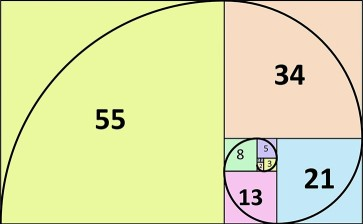
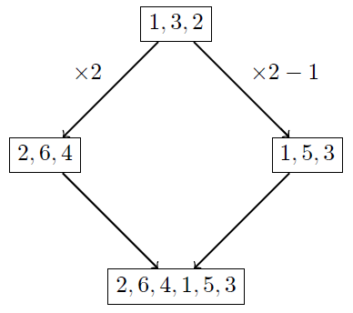
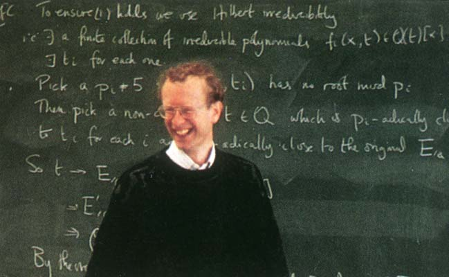

## Introduction

    
Mathematical induction is a proof technique based upon showing that if a statement holds in one instance, then it must also hold for the next one. It can be likened to setting up dominoes so that if one falls over, then all of the others follow. Typically, this is used to prove statements of the form P(n) based upon a natural number n.

    

</img>

Some of the most natural applications of induction arise from spotting patterns in arithmetic. For example, one may consider the sums

$$
\begin{aligned}
1 &= 1 \\
1 + 2 &= 3 \\
1 + 2 + 3 &= 6 \\
1 + 2 + 3 + 4 &= 10 \\
...
\end{aligned}
$$

and guess the pattern $1 + 2 + ... + n=\frac{1}{2}n(n + 1)$. However, it may be more tricky to rigorously prove this result. This is where induction comes in. 

Let $P(n)$ be the hypothesis that $1 + 2 + ... + n = \frac{1}{2}n(n + 1)$. 

First, we establish a simple base case, such as $n = 1: \frac{1}{2}(1)(1 + 1) = 1$. 

Then, we show that if $P(n)$ is true for some number $n$, then $P(n + 1)$ must also be true. 

We do this by applying the result of $P(n)$ to the sum $1 + 2 + ... + n + (n + 1)$:

$$
\begin{aligned}
1 + 2 + ... + n + (n + 1) &= \frac{1}{2}n(n + 1) + (n + 1) \\\
&= \frac{1}{2}(n(n + 1) + 2(n + 1)) \\\
&= \frac{1}{2}(n+1)(n+2)
\end{aligned}
$$

This is just the statement of $P(n + 1)$. In other words, if this works for one number, then it must work for the next. But we have already established $P(1)$, which implies $P(2)$, which implies $P(3)$, and so on for every natural number.

We have now completed a proof by induction. As a note, the base case does not have to be 1: you may choose $P(b)$ as your base case for some $b$, and then prove $P(n)$ for all $n ≥ b$. If you wish, try proving the following theorem by induction as an exercise:

_For all $n ≥ 3$, the sum of the angles of a polygon with $n$ vertices is $180(n - 2)$._

## Strong Induction - The Fibonacci Sequence

In the inductive step so far we have taken $P(n)$ as given and then proved $P(n + 1)$. In fact, with base case $P(b)$, we may assume all $P(k)$ for $b ≤ k ≤ n$. For example, if $P(3)$ is our base case, then $P(3)$ implies $P(4)$, $P(3)$ and $P(4)$ together imply $P(5)$, and so on. This is known as strong induction, since it uses a stronger prerequisite assumption than standard ("weak") induction.

One useful application of this technique comes from considering the Fibonacci sequence: 

$$
F_0 = 0, F_1 = 1, F_n = F_{(n - 1)} + F_{(n - 2)}
$$

The first ten terms are:

$$
0, 1, 1, 2, 3, 5, 8, 13, 21, 34, ...
$$

What we seek is a formula for the nth Fibonacci number. Looking at the sequence, it is reasonable to guess that this formula is exponential in nature. Therefore, we substitute $F_n = x^n$ into the recursive formula to get:

$$
\begin{aligned}
x^n & =x^{(n - 1)} + x^{(n-2)} \\\
x^n - x^{(n-1)} - x^{(n-2)} &= 0 \\\
x^{(n-2)}(x^2 - x - 1) &= 0
\end{aligned}
$$

$$
x = 0, x = \frac{1 + \sqrt{5}}{2} = 1.618..., x = \frac{1 - \sqrt{5}}{2} = -0.618...
$$

However, $x = 0$ is clearly invalid for $n = 2$. We name the remaining two roots $\phi$ and $\psi$ respectively, and guess that $F_n = a\phi^n + b\psi^n$ for some unknown $a$ and $b$ - in other words, a linear combination of powers of $\phi$ and $\psi$. Trying the first few values, we can update our hypothesis $P(n)$ to:

$$
F_n = \frac{ϕ^n - ψ^n}{ϕ - ψ}
$$

We start with two base cases, $P(0)$ and $P(1)$ (i.e. $n = 0$ and $n = 1$): 

$\frac{\phi^{0}-\psi^{0}}{\phi-\psi} = 0 = F_{0}$, and $\frac{\phi^{1}-\psi^{1}}{\phi-\psi} = 1 = F_{1}$. 

Now in the strong inductive step, we show that for any $n$, $P(n - 1)$ and $P(n)$ imply $P(n + 1)$:

$$
\begin{aligned}
F_{n + 1} &= F_{n} + F_{n - 1} \\\
&= \frac{\phi^{n} - \psi^{n}}{\phi - \psi} + \frac{\phi^{n - 1} - \psi^{n - 1}}{\phi - \psi} \\\
&= \frac{(\phi^{n} + \phi^{n - 1}) - (\psi^{n} + \psi^{n - 1})}{\phi - \psi} \\\
&= \frac{\phi^{n + 1} - \psi^{n + 1}}{\phi - \psi}
\end{aligned}
$$

In the last step, we used the earlier formula $x^{n} = x^{n-1} + x^{n-2}$ for both $\phi$ and $\psi$. Now $P(0)$ and $P(1)$ imply $P(2)$, $P(1)$ and $P(2)$ imply $P(3)$, and so on, and the proof is complete. As another optional exercise, try to prove the following statement by strong induction:

<em>Any natural number can be written as a sum of Fibonacci numbers</em>

<em>Figure: The Fibonacci numbers and the golden ratio, ϕ, are closely linked to well-known spirals and other patterns that occur in nature</em>

## Forward-Backward Induction

This is where our methods begin to become more esoteric and specialised. However, they are still useful tools for those who want to study maths at a higher level. In order to explain forward-backward induction, I will first present an example and then discuss the structure of the proof. 

The problem is as follows: 

<em>Show that for any natural number n the sequence 1, 2, 3, ... n can be rearranged such that the mean of any two numbers is not between those two numbers in the sequence.</em>

For example, if $n=4$, the sequence $1, 3, 2, 4$ would be valid, but the sequence $4, 3, 1, 2$ would not, as the mean of 4 and 2 (i.e. 3) is between them in the sequence. 

This problem would not be out of place in a maths olympiad. However, it may seem difficult to approach at first glance. One good strategy is to try small values of n and try to seek a pattern. For example, taking $n = 6$, we can construct a few sequences such as:

$$
2, 6, 4, 1, 5, 3 \\[4px]
3, 1, 5, 6, 2, 4 \\[4px]
4, 2, 6, 3, 5, 1 
$$

One thing may stand out to you: the even numbers and the odd numbers seem to be separated. Why is this? Well, the mean of an odd number and an even number is not an integer, so it does not need to be considered. This neatly splits the sequence into two parts. In fact, given a sequence, we can multiply all the terms by 2 to get a sequence of even numbers, and take away 1 from each term in that sequence to get a sequence of odd numbers which both maintain our desired property. Finally, we can simply connect those two sequences to get a valid sequence with twice the length of the original.

So, if we take the trivial sequence for $n = 1$ (which is just the number 1), we can use this process to construct a sequence with length 2, then a sequence with length 4, length 8, etc. But how do we fill in the gaps between these powers of 2? Well, removing a number from a sequence is certainly not going to render it invalid. So if we want a valid sequence of length 13, for example, we can just construct a sequence of length 16 and remove the numbers 14, 15, and 16. Therefore, we have shown that a valid sequence can be constructed for any natural number $n$. 

In general, a proof by forward-backward induction has three steps: establish a base case $P(b)$. Then, show that for any $n$, $P(n)$ implies some $P(k)$ where $k > n$. Finally, show that when $b<n$, $P(n)$ implies $P(n - 1)$. In effect, this is like skipping forward in large jumps, and then going backwards in small steps. 

To end this section, I will present Cauchy's well-known proof of the arithmetic mean/geometric mean (AM-GM) inequality, which states that for non-negative real numbers $a_{1}, a_{2}, ... a_{n}$, then: 

$$
\frac{a_{1} + a_{2} + ... + a_{n}}{n} ≥ \sqrt[n]{a_{1}a_{2}...a_{n}}
$$

Starting with base case $n = 2$:

$$
\begin{aligned}
(\sqrt{a_{1}} - \sqrt{a_{2}})^{2} &≥ 0 \\\
a_{1} + a_{2} - 2\sqrt{a_{1}a_{2}} &≥ 0 \\\
a_{1} + a_{2} &≥ 2\sqrt{a_{1}a_{2}} \\\
\frac{a_{1} + a_{2}}{2} &≥ \sqrt{a_{1}a_{2}}
\end{aligned}
$$

The first inequality holds because a real number squared is always non-negative. Then, for the forward induction step, we show that for any $n$, $P(n)$ implies $P(2n)$. (This is not the only possible way to "jump" forwards, but it is the most common.)

$$
\begin{aligned}
\frac{a_{1}+a_{2}+...+a_{2n}}{2n} &= \frac{\frac{a_{1}+a_{2}+...+a_{n}}{n} + \frac{a_{n+1}+a_{n+2}+...+a_{2n}}{n}}{2} \\\
&≥ \frac{\sqrt[n]{a_{1}a_{2}...a_{n}}+\sqrt[n]{a_{n+1}a_{n+2}...a_{2n}}}{2} \\\
&≥ \sqrt{\sqrt[n]{a_{1}a_{2}...a_{n}}\sqrt[n]{a_{n+1}a_{n+2}...a_{2n}}} \\\
&= \sqrt[2n]{a_{1}a_{2}...a_{2n}}
\end{aligned}
$$

The first inequality follows from applying of AM-GM with $n$ variables on $\frac{a_{1}+a_{2}+...+a_{n}}{n}$ and $\frac{a_{n+1}+a_{n+2}+...+a_{2n}}{n}$. The second follows from applying AM-GM on the 2 terms in the numerator. 

For the backward induction step, substitute $a_{n} = \frac{a_{1} + a_{2} + ... + a_{n-1}}{n-1}$. 

Then:

$$
\begin{aligned}
\frac{a_{1} + a_{2} + ... + a_{n-1} + \frac{a_{1} + a_{2} + ... + a_{n-1}}{n-1}}{n} &\geq \sqrt[n]{a_{1}a_{2}...a_{n-1}(\frac{a_{1} + a_{2} + ... + a_{n-1}}{n-1})} \\\
\frac{a_{1} + a_{2} + ... + a_{n-1}}{n-1} &\geq \sqrt[n]{a_{1}a_{2}...a_{n-1}(\frac{a_{1} + a_{2} + ... + a_{n-1}}{n-1})} \\\
(\frac{a_{1} + a_{2} + ... + a_{n-1}}{n-1})^{n} &\geq a_{1}a_{2}...a_{n-1}(\frac{a_{1} + a_{2} + ... + a_{n-1}}{n-1}) \\\
(\frac{a_{1} + a_{2} + ... + a_{n-1}}{n-1})^{n-1} &\geq a_{1}a_{2}...a_{n-1} \\\
\frac{a_{1} + a_{2} + ... + a_{n-1}}{n-1} &\geq \sqrt[n-1]{a_{1}a_{2}...a_{n-1}}
\end{aligned}
$$

Therefore, $P(n)$ implies $P(n-1)$. To summarise, $P(1)$ is true, and for any $n$, $P(n)$ implies $P(2n)$, and $P(n)$ implies $P(n-1)$. Therefore, $P(n)$ is true for all natural $n$. This completes the proof.

## Two-Dimensional Induction

This is the last form of induction which could be expected to appear until well into a university maths degree. Here, we switch from a proposition in one natural variable $P(n$ to one in two, $P(m, n)$. However, there are actually various methods of completing the induction step: 

1) Show $P(1, 1)$ as a base case. Then, show that for any m and n, $P(m, n)$ implies $P(m+1, n)$ and $P(m, n)$ implies $P(m, n+1)$. 
2) Show $P(a, 1)$ for any $a$ and $P(1, b)$ for any $b$ as base cases. Then, show that for any m and n, $P(m, n)$ implies $P(m+1, n+1)$. 
3) Show $P(a, 1)$ for any $a$ and $P(1, b)$ for any $b$ as base cases. Then, show that for any m and n, $P(m+1, n)$ and $P(m, n+1)$ together imply $P(m+1, n+1)$. 
4) Let $Q(k)$ be the proposition that $P(m, n)$ is true for all $m+n=k$. Then, perform normal induction on $Q(k)$. 

The first example will be a relatively well-known combinatorics result which is not normally proved by induction. The problem is as follows: 

_Show that for non-negative integer variables $x_{1}, x_{2}, ... x_{m}$ and integer $n$, the number of different combinations such that $x_{1} + x_{2} + ... + x_{m} = n$ is equal to ${n+m-1 \choose n}$._

Here ${n+m-1 \choose n}$ is the "choose" function, whose values appear in Pascal's triangle and binomial coefficients. To prove this statement, we choose method 3, and start with the base cases: If $n=1$, then there are clearly only $m$ combinations as one variable must be one and the rest must be zero. Accordingly, ${1+m-1 \choose 1} = {m \choose 1} = 1$. On the other hand, if $m=1$, then there is clearly only one solution to the equation $x_{1} = n$, and ${n+1-1 \choose n} = {n \choose n} = 1$. 

For the inductive step, we split into two cases: $x_{1}=0$ or $x_{1} \geq 1$. In the first case, $x_{1}$ can be ignored and there are $m-1$ variables on the left-hand side remaining. This is equivalent to the case $P(m-1, n)$. In the second case, take 1 away from both sides to get:

$$
(x_{1}-1) + x_{2} + ... + x_{m} = n-1
$$

But since $x_{1} \geq 1$, $x_{1}-1$ is simply non-negative and is equivalent to the other variables, and this case is equivalent to $P(m, n-1)$. The total number of combinations is just the sum of combinations within these two cases, and by considering the properties of Pascal's triangle, we see that 

$$
\begin{aligned}
{n+(m-1)-1 \choose n} + {(n-1)+m-1 \choose (n-1)} &= {n+m-2 \choose n} + {n+m-2 \choose n-1} \\\
&= {n+m-1 \choose n}
\end{aligned}
$$

This completes the inductive step, and the proof. 

As an exercise, try this question, using method 1) outlined at the start of this section: 

_Let $f(m,n)$ be a function on natural numbers m and n such that $f(1,1) = 1$ and:_
$$
\begin{aligned}
f(m+1,n) &= f(m,n) +2(m+n)  \\\
f(m,n+1) &= f(m,n) +2(m+n-1)
\end{aligned}
$$
_Show that $f(m,n) = (m + n)^{2} – (m + n) – 2n +2$._

## Advanced Methods

As a rigorous explanation of these methods would be well beyond the scope of this article, I will mention them briefly along with a few common applications of each. One thing that surprised me in the process of writing this article was the volume of theorems in advanced set theory and group theory that used induction, relative to those in more accessible areas. Therefore, I will attempt to give a glimpse of some notable results and leave further research to those who are particularly interested. 

### Structural Induction

Structural induction is a technique common in graph theory and computer science concerning recursively defined structures such as formulas or tree graphs. Essentially, for some structure $x$, a proof of a property $P(x)$ constitutes showing that $P$ holds on some minimal substructure such as a single node of a graph. Then, it is shown that if $P$ holds for the immediate substructures of some $S$, then it must also hold for $S$.  

The most important theorem that uses structural induction in its proof is Łoś's theorem, also known as the fundamental theorem of ultraproducts (which are defined as a quotient of a direct product of a family of structures). 

### Transfinite Induction

Transfinite induction is induction on ordinal numbers, which is a generalisation of the natural numbers to counting with infinite sets. The process is the same except that an extra step needs to be performed to jump forward to each limit ordinal, which is an ordinal number that cannot be reached by incrementing from smaller ordinal numbers. 

One surprising example of transfinite induction is its use in proving Goodstein's theorem, which is a theorem about recursive sequences called Goodstein sequences. First, start with any natural number as the first term. Then, write the number as a sum of powers of 2, and write each exponent as a sum of powers of 2, etc. (for example, $19=2^{2^{2}} + 2 + 1$). This is called the hereditary base 2 representation. Then, replace each 2 in the expression with a 3, and subtract 1. This is the second term of the sequence. The $n$th term is found by writing the previous term in hereditary base $n$ representation, then replacing each $n$ with $n+1$ and subtracting 1. The statement of the theorem is that every Goodstein sequence must eventually reach 0. 

The proof of Goodstein's theorem roughly entails showing that it is possible to construct a sequence of ordinal numbers parallel to the Goodstein sequence which is strictly decreasing and terminates. Therefore, the Goodstein sequence must also terminate at 0. This result is historically significant since it is one of the first true statements to be shown to be unprovable in a system of logic called Peano arithmetic, as was proved by the mathematicians Laurie Kirby and Jeff Paris in 1982. 

### Fermat's Last Theorem

The details of Andrew Wiles' famous proof of Fermat's Last theorem are of course inaccessible to the common person, but I feel it would be remiss to not mention it briefly. Fermat's Last Theorem is named so because it was the last theorem left unproved by the great Pierre de Fermat for hundreds of years after his death. There is a well-known story that Fermat wrote the theorem in a margin of his textbook, along with the words "I have a marvellous proof of this theorem, which this margin is too small to contain." Nowadays, mathematicians doubt whether he did indeed find a valid proof with the mathematical tools available to him at the time. In any case, the theorem reads: 

_For any integer $n > 2$, there are no positive integers a, b, and c such that $a^{n} + b^{n} = c^{n}$._

Wiles' proof, very briefly, works by rearranging the above equation to that of an elliptic curve, which is a family of curves typically described by the equation $y^{2} = x^{3} + ax + b$. Then, he proved a special case of the Taniyama-Shimura conjecture, otherwise known as the modularity theorem, which establishes a link between those elliptic curves and certain types of analytic functions called modular forms. Using this link, he showed that the elliptic curve resulting from Fermat's Last theorem failed to satisfy certain properties when turned into a modular form, therefore showing that the original equation has no solutions. As it happens, induction is used multiple times in intermediate steps of the proof, giving it the status of perhaps the most important applications of induction in recent years. 

## Conclusion

Mathematical induction is a unique method of proof in mathematics with highly varied applications requiring insight and precise reasoning. I hope that through the techniques I have presented in this article, the reader may soon spot more and more inductive reasoning in their day to day maths, or at least gain an appreciation of how it works and how it has contributed to the subject as a whole.

## Miscellaneous notes

For anyone familiar with these notations, the principle (or "axiom") of induction can be written in second-order logic and first-order ZFC set theory respectively as follows:

$$
\forall P (P(0) \land \forall k (P(k) \rightarrow P(k+1)) \rightarrow \forall n (P(n))) \\
\forall A (0 \in A \land \forall k (k \in A \rightarrow (k+1) \in A) \rightarrow \mathbb{N} \subseteq A)
$$

<h2>Bibliography</h2>

- https://en.wikipedia.org/wiki/Mathematical_induction
- https://r-knott.surrey.ac.uk/Fibonacci/fibformproof.html
- https://brilliant.org/wiki/forward-backwards-induction
- https://www.mathblog.dk/proof-method-multidimensional-induction/
- https://mathworld.wolfram.com/TransfiniteInduction.html
- https://en.wikipedia.org/wiki/Wiles%27s_proof_of_Fermat%27s_Last_Theorem
- https://simonsingh.net/books/fermats-last-theorem/who-is-andrew-wiles/

