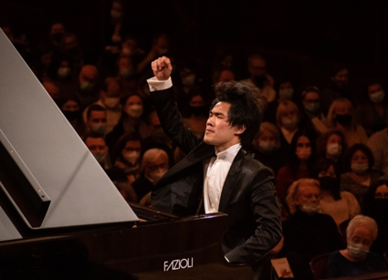
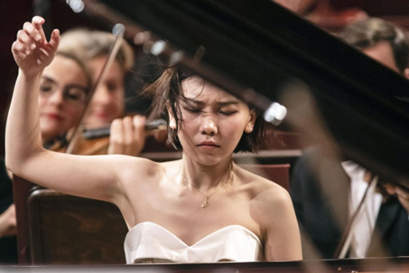
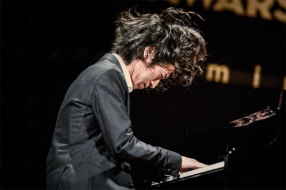

## 1 - Play the Correct Notes
Not really a revolutionary idea, but last year was a great reminder that the first step to playing at an elite level is to play all the correct notes whilst making little to no mistakes. No omission of the correct note or no inclusion of a wrong note will make a high scoring performance. 

Obviously in other musical contexts, a wrong note can be worked around. To quote Miles Davis: “When you hit a wrong note, it’s the next note that makes it good or bad”. 

However, in the context of 21st century piano competitions, to play a wrong note is to sin. It is the quickest way to notify the jurors that more time could have been spent working on the musical skeleton of the piece. Familiarising yourself with the pitches of the music is the highest priority before adding your own interpretational ideas to the piece. 

Obviously, fruity things happen on stage: perhaps you can feel a member of the jury really laying down judgement on you for your hair; maybe your mum is in the crowd somewhere; maybe you just don’t have a lot of experience. Whatever the reason, we can get nervous and make mistakes as a result. That’s just one of those things that happens. Even at the highest level, those performers are still human; depending on the musical context and degree of error, the mistake may go unnoticed. When you make a mistake in a performance setting: the best response is to ignore it and recover the piece. 

However, in a practice setting we should really be aiming for as perfect as possible. When you make a mistake during practice: the best response is to go back and correct it such that you minimise the chance of making the same mistake again. This also ensures that we learn the music as written - reducing our chance of producing errors on stage.

Practice slowly and diligently. Our art form is a discipline, first and foremost. To quote a certain concert pianist when asked why he never played wrong notes, “I don’t practice them”. The need for self control cannot be understated here, so going slow and steady with a metronome is ideal. If you are recapitulating lines of music without any attention to exactly what you hear, that’s not really practising - that’s playing.

Our goal when practising should be to play through something without making mistakes - this means we cannot approximate or guess anything: not the time, not the melody, not the fingering. Every detail should be deliberate and controlled. 

The amount of music you end up playing doesn’t matter. During practice, the only metric you should be counting is the number of mistakes you make. Graham Fitch emphasises the quality of practice being important: suggesting a routine of smaller, focussed practice sessions of 20-30 minutes each. The bottom line is if you cannot play a piece through slowly with no mistakes, you cannot assume that you can do so at tempo, whilst adding artistic flair and interpretation in a performance setting.

## 2 - Clarity as a Tool
Upon watching Bruce Liu’s final round performance, the first thing someone might notice is how blazingly fast Liu can play. It becomes really obvious that this guy goes at whatever speed he wants because of his technical capacity. While his competitors might be surviving through certain passages, Liu exercises his talent-founded prerogative to play them however he likes. It’s really easy to forget or outright dismiss other merits of Liu’s playing given his captivating dexterity.

    

</img>

    
Complementing Liu’s demonic speed and fluidity is his crystalline clarity. We might talk about a melody being particularly embellished with cascading runs and exciting turns but Liu really does play the ornaments - there are no real embellishments. The “embellishments” are considered part of the melody.

Clarity is the result of a strong technical foundation combined with true legato. Because of that, it allows us to communicate that we are technically fluent and mechanically able to express ourselves on our instrument - it gives your performance a virtuosic spice. More importantly, clarity helps communicate melodic ideas to our audience. Musical ideas may not form as a result of clarity, but they are often greatly aided by it; if the audience cannot clearly make out what we are playing, we cannot hope to communicate our musical ideas to them. 

Liu is clearly an incredibly talented individual and plays better than the majority of us could ever hope to play. In an interview for The Korea Times, Liu humbly stated that piano is just a “hobby” which he carries lots of passion for. However, is there anything that we could take away from his playing?

We often are easily able to achieve the connection part of legato by allowing our notes to overlap each other. However, that makes our playing hazy and we lose clarity. One way to improve clarity from practice is to practise our melodies staccato. After a few times, we can gradually lengthen the duration of the notes we play until they are connected without overlapping. At this point we will have achieved true legato with perfect clarity. 

## 3 - The Need for Musicality

    
Fans of Aimi Kobayashi may look back to her showing in 2015 and remember the agitation and fire she played with. A raw, emotionally turbulent player who dictated rubato, dynamics, and articulation to create a crude sensation.  In contrast, the Aimi Kobayashi who came out last year was much more controlled and deliberate. She still encapsulates reverie and effect extremely well, but there’s a hint of refinement in it. The kind of control that you’d only expect from someone who could perceive time slower - that’s what she showed us last year.

    

</img>

In her performance of the Concerto in E minor, op.11 in the final round, Kobayashi played at a much slower tempo than the accepted interpretation. She chose to throw away virtuosity in exchange for delicate, contoured playing. It’s at this slower tempo that Kobayashi shows off her ability to craft and shape melodic lines into something beyond the standard often displayed at the highest level. Kobayashi’s delicate touches dance effortlessly across the higher register and cascade melodiously downwards. Despite the slower tempo, it’s still very much Kobayashi: emotional playing directed meticulously by the individual fingers; she’s just being honest about her interpretation. It’s a brave thing to go against the grain in any context, but especially so in a well established piece at an international competition. From a competitive standpoint it falls short, Kobayashi misses out on opportunities to show off her technicality; from a musical standpoint her gambit paid dividends: although it’s not quite the technical spectacle of Bruce Liu, it’s utterly beautiful. 

Some identifying characteristics of Chopin’s work are the lyrical melodies which often sit upon a strong harmonic accompaniment which really carry his heightened level of emotional expression. Kobayashi takes this writing and invites herself to freely express herself musically across the piano. 

I think what we could all learn from her performance is how the temperament of your nature can affect your playing. Sometimes it may seem musically inappropriate, but there is a reward to allowing yourself to actually play more. Of course, it is also important to recognise when you are overplaying but that’s something that comes with time, as it did for Kobayashi. 

In practise we can work on our musicality by really playing to our ear’s decree. “Is what I’m playing really what I want it to sound like?” If we find ourselves struggling, we can turn to other sources for inspiration: “how does famous performer A play this part? How does famous performer B do it? Which do I prefer?”. Find out how your teacher might play that line. Questions like these can shape our interpretations immensely. Fuss over every detail to make sure your work is a true expression of self.

## 4 - Communication is Key
As Tiffany Poon noted in a 2020 interview with Bachtrack, classical music has a “disconnect between the audience and the music. The composers are dead and there just isn’t that human connection anymore.” She’s profoundly right. 

    

</img>

    
Hayato Sumino might not have made it into the final round, but he definitely reached a lot of people with his communicative instinct. His first round performance has so far garnered 2.8 million views, the most of any non final round performance. 

Listening to Sumino is really easy. He writes all his feelings and nuances down on a piece of paper for you to look at and read. Although Kobayashi is musically brilliant, it’s not quite as near to us as Sumino. And I feel like that’s exactly what makes him so great; Sumino has this ability to speak to us through his playing: every little articulation carries that spark of life which, in turn, gives his performances a refreshing vitality.  

Sometimes we have a specific narrative to convey if we are playing program music. Of course, in this scenario our job, as the musicians, is to pass on the extramusical meaning to our audience.

Sometimes we are lucky enough to have a creative motive accessible to us; in this case it might be worth trying to come up with your own related narrative to communicate back to the audience. 

If we are very unfortunate, we might not have the background or creative motive behind a piece accessible to us either. In such cases, a safe but liberating approach is to extrapolate whatever emotions naturally come to you from the music. 

I think for a lot of us musicians, we don’t really struggle with conveying any given emotion on command. It’s just the ambiguity of what we are meant to do given source material which has gone through potentially hundreds of years. My interpretation cannot bring Schubert’s very will and message back.

A first step towards improving your communication on your instrument is to define exactly what emotion you, the performer, are trying to convey - not the emotion that the composer wanted to convey, and certainly not whatever emotion the audience will extrapolate from you. We want to keep the creative vision in our mind transparent, not sentimentally self-indulgent, and most importantly - it should largely come from us. 

Once we have defined our creative vision, we should then be able to use our sonar palette to shape our interpretation into a refined product. As clichéd as it sounds, there isn’t really an incorrect answer here - but it has to be with the goal of communicating. “Does that tenuto actually help us convey an emotion or does it feel good to play?” The clearer your creative vision is, the easier this part should be. 

It’s important to understand that your interpretation can change.Allow yourself to change bits of it - allow your musicality to guide your creative choices, including how you choose to communicate a piece. 

## Closing Comments
As Adam Neely famously thrice said, "repetition legitimises". With that in spirit let's quickly recap the 4 main points:
Before refining an interpretation, practise slowly and make sure you are playing the correct notes
Improve your clarity by practising the quality of legato
Deeply consider your interpretation of the music, and let your musicality guide it 
Don't forget to make sure you do a good job of communicating your interpretation
The International Chopin Piano Competition is one of the world's most prestigious piano competitions, which are becoming increasingly competitive each year. The propagation of high fidelity, flawless recordings has led to concert musicians at competitions seeing their standards rise. This article is horrifically guilty of having indulged in music as a sport and a stark reminder is due to let us all remember that music is an art form before anything else.

I hope this article serves as a way for you to improve your own playing. If my suggestions don't work for you, I would at least hope that this article serves to allude to particular elements of your own playing - and that you seek to improve upon those particular elements.
