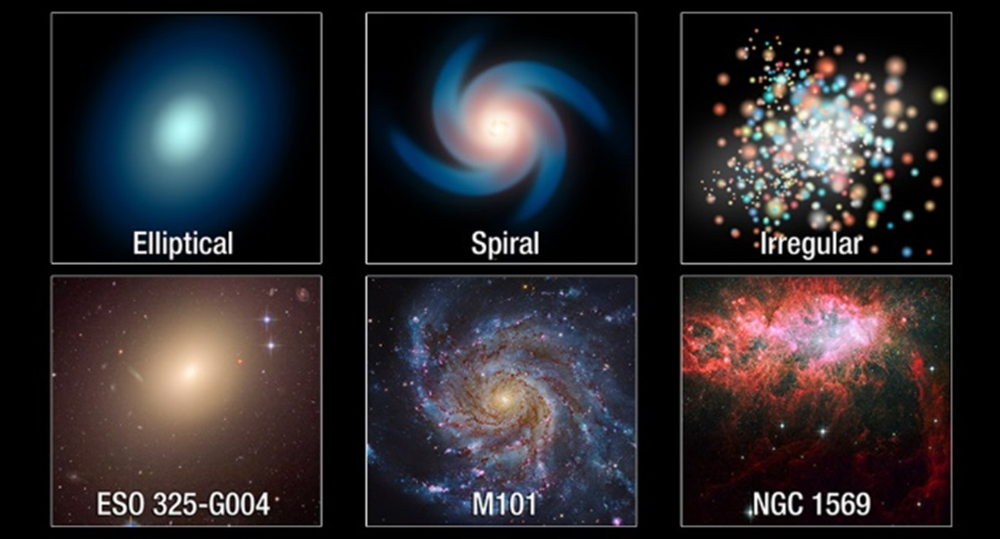
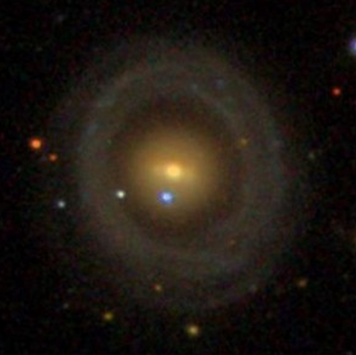
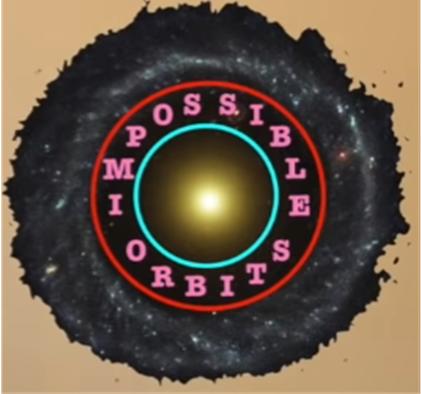
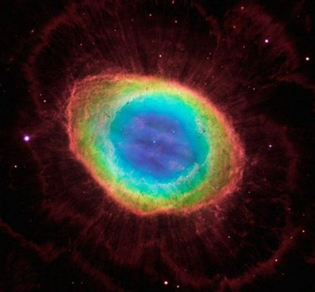
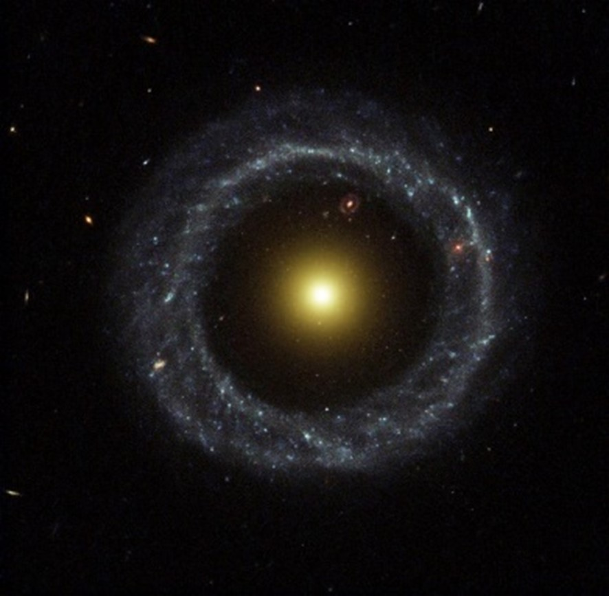

## Introduction

    

        
</img>

        <em>Fig. 1 Illustrations of the three main types of galaxies (top) with actual photos of galaxies (bottom) that fit the categories. [2]</em>
    

    
Almost every galaxy in our universe can be categorised into three types: Spiral, elliptical, or irregular (see Fig.1). This system of classifying galaxies via their shapes was first established by Edwin Hubble [1].  Spiral galaxies are further divided into three classes based on their shapes: Ordinary spiral galaxies (consisting of a central bulge and spiral arms), barred spiral galaxies (featuring an elongated bar of stars across the central bulge), and lenticular spiral galaxies (having disc-shaped features as opposed to spiral arms) [1]. These galaxies appear to be very “dusty” and make up approximately 60% of all galaxies.

Elliptical galaxies, on the other hand, are differentiated based on a scale ranging from E0 to E5, where E0 is spherical and E5 is elongated. They are observed to have very little dust and gas compared to spiral galaxies, but appear to be older [1], making up 10-15% of all galaxies.

Lastly, irregular galaxies consist of galaxies that have no regular shape or form. They are estimated to make up 25% of all galaxies, and are believed to have been more prevalent in the early universe. Additionally, these galaxies are generally smaller, and are often satellite galaxies of larger spiral or elliptical galaxies [1].  

However, some galaxies fall outside this classification system; approximately one in ten thousand galaxies fall into one of the rarest categories – ring galaxies. 

## Properties of Ring Galaxies

    
So, what are some key features of these phenomenal galaxies? Starting with the most obvious property, a ring galaxy consists of a central core surrounded by a ring of luminous stars. However, between these layers, there exists a gap (shown in Fig. 2); a region of low density. Almost no stars and very little gas separates these two layers. The relatively compact core has a low gas composition and consists primarily of older stars [3]. Comparatively, the ring appears to be “bluer” than the core (due to the stronger concentration of short-lived blue stars), indicating that the stars within the ring were formed more recently. Additionally, when astronomers observed where these galaxies were generally located, they found that the galaxies were spread out in a region commonly referred to as “the field” [3] as opposed to the more central location of galaxy clusters.

    

        
</img>

        <em>Fig. 2 The galaxy NGC 6028 representing an ideal ring galaxy [3]</em>
    

    

        
</img>

        <em>Fig. 3 A graphical representation of the point at which the forces balance (red) and the last circular orbit (blue) [4]</em>
    

    
Recently, in 2018, Elena Bannikova, a professor of astronomy at the University of Kharkiv, analysed the motion of particles within a specific ring galaxy – the Hoag’s Object – using a theoretical and mathematical approach. From her calculations, she found that the forces between the ring and the central core balance on the inner edge of the ring (shown in red in Fig. 3). She also calculated where the last stable circular orbit could occur (since the circulating object may be disturbed by the ring beyond a certain limit), finding a circular locus outside the core (see Fig.3). Between these two circles, there exists a space where circular orbits cannot exist. From these observations, scientists have been given an understanding towards why this gap between the ring and the core exists.

## A Brief History of Ring Galaxies

    
Dating back to 1950, the first ever ring galaxy, Hoag’s Object, was discovered by Art Hoag, baffling astronomers of its existence. At that time, the only method to making a ring-like object in space was where a central bright core was surrounded by a luminous halo i.e., a planetary nebula, such as the Ring Nebula in Fig. 4.  Over the years, the number of ring galaxies being discovered has multiplied drastically, especially recently, with the current number having increased to approximately 40,000. A project called “Galaxy Zoo” [6] recruited thousands of volunteers to identify the morphology of various galaxies [6], from which an AI algorithm, called “Zoobot” was produced. It utilised the inputs from these volunteers, and accurately identified galaxy shapes as well as predicting where it may be mistaken. This algorithm helped identify these ring galaxies, providing a dataset that can be used to reveal how galaxies evolve.
 
    

        
</img>

        <em>Fig. 4 A composite image of the Ring Nebula [5]</em>
    

## Formation of Hoag’s Object

    

        
</img>

        <em>Hoag's Object, the first ring galaxy, discovered in 1950 [3]</em>
    

    
There are several theories aiming to resolve the enigma of the formation of Hoag’s Object, some more elaborate than others.  
    As mentioned earlier, Hoag’s Object (Fig.5) was first discovered in 1950, named after astronomer Arthur Hoag. When he first discovered this phenomenon, he explained that the “size and nucleus” were not of the typical planetary nebula, subsequently, labelling the object as a potential “new species” of galaxy [7]. Although he proposed other possible theories, including a diffraction effect or a gravitational lens system (occurs when a massive celestial object “bends” the path of light around it), he referred to them as “less probable explanations”.

Looking deeper into the structure of the object, the halo was observed to consist of young, blue stars, as opposed to the strong emission lines expected by a nebulae model, proving that Hoag’s object was of the galactic nature [3]. Furthermore, the idea of a gravitational lens or a diffraction phenomenon were both invalidated since the centre of the galaxy and the halo displayed identical redshifts, showing that they are both part of the same system [5]. So how is this galaxy formed?

One theory includes the unstable bar model, proposed by Noah Brosch in 1985 [8], where the rotational velocity of the bar in a barred spiral galaxy increases to a certain point, until the bar structure becomes unstable, leading to a “spiral spin out”. This would result in a ring-like structure. The creation of the luminous halo of stars is due to the density waves from the unstable bar spreading out into a ring, also called a resonance ring [8]. As a result, the increase in pressure and gravitational force caused by the density waves promotes star formation, leaving behind a centre of older stars. However, in 1987, Schweizer et al. provided a strong counter argument against this theory; they detected a H I component (which informs us about the different processes that shape a galaxy) much larger than the upper limit within Brosch’s model [8], determining that the galaxy was in fact spheroidal, not disc-like which would be required for a bar instability to occur, disapproving of the Brosch hypothesis. Although it would be theoretically possible for a core to evolve from a disc shape into a spherical, they concluded that this scenario was unlikely [9]. Additionally, Brosch failed to detect remnants of a bar-like structure, further providing evidence against this theory.

Another theory proposed was that of a collision between two galaxies. Schweizer also discussed this proposition. Using two telescopes (one for optical photometry and optical spectroscopy, the other being a radio telescope [9]), their observations established that the ring and the core had the same radial velocity and distance from the Earth, concluding that both the core and the ring must form a single object. Hence, this eliminated the collision hypothesis. 

Instead, Schweizer et al. put forward a new hypothesis – a major accretion event. 

They proposed that the structure of Hoag’s object was a result of a major accretion event 2-3 Gyr ago. In essence, this was an interaction between a massive elliptical galaxy and a much smaller galaxy, although not through a merging process or a collision. As a smaller galaxy comes into the gravitational influence of the larger galaxy, the smaller galaxy become stripped apart, resulting in a rounder core [4]. Schweizer et al. emphasised a lack of ripple or merging signatures, implying that this event could not have taken place recently, placing this event at least 2-3 billion years in the past. They also mentioned the presence of bright knots in the ring, which are aligned to a narrow ring that exists off-centre, suggesting that the ring is not completely settled.

But how viable is this theory? Approaching the physical properties of the ring, analysis of the colours of the stars within the ring indicate a stellar population that is younger than 2 Gyr, which is consistent with this hypothesis. Additionally, by analysing the ionised gas velocity map [8], strong limits have been enforced on Hoag’s Object, although still consistent with the theory. However, by measuring the volume of gas in the ring, astronomers found out that it would not have been possible to accumulate that much stellar mass from a smaller galaxy that was hypothesised [4], ruling out this theory.

Another group of scientists in 2011 [8] proposed a new theory where the core and the ring were formed separately. Starting with the core, the idea behind its formation is that it is a remnant from a cluster of galaxies that have merged together to form a spherical structure. Subsequently, the ring could be formed from the slow accretion of intergalactic medium [4] i.e., the gas remaining from the galaxies before the merge. This gas would theoretically circle around the core, and eventually start forming stars. An issue with this theory is that there is no explanation for why the gas would accrete into a ring instead of a disc, leaving a hole in this hypothesis. 

Since its discovery in 1950, the Hoag’s Object has puzzled astronomers. Theories of its formation have consistently appeared, causing controversial debates over this phenomenon. But over 70 years later, the “peculiar galaxy in Serpens” still remains a mystery.

<h2>Bibliography</h2>

[1] Reynolds, M, Introduction to Astronomy, Available at: https://fscj.pressbooks.pub/introductionastronomy/ (Accessed 12/08/2022)

[2] NASA Hubble Site, Galaxies: The Building Blocks of the Universe, Available at: https://hubblesite.org/science/galaxies (Accessed: 09/08/2022)

[3] Siegel, E (2022), Ring galaxies, the rarest in the Universe, finally explained, Available at: https://medium.com/starts-with-a-bang/ring-galaxies-the-rarest-in-the-universe-finally-explained-ddb4ad6e2d33 (Accessed: 09/08/2022)

[4] Smethurst, R (2018), Hoag's Object | The Mystery of Ring Galaxies, Available at: https://www.youtube.com/watch?v=uE46_wuj7P0 (Accessed: 19/08/2022)

[5] Siegel, E (2020), Astronomy's Most Perfect Ring Galaxy, Hoag's Object, Is Still A Mystery After 70 Years, Available at: https://www.forbes.com/sites/startswithabang/2020/07/08/astronomys-most-perfect-ring-galaxy-hoags-object-is-still-a-mystery-after-70-years/ (Accessed: 10/08/2022)

[6] Robinson, B (2022), Cyborg collaboration finds 40,000 ring galaxies, Available at: https://www.manchester.ac.uk/discover/news/cyborg-collaboration-finds-40000-ring-galaxies/ (Accessed: 11/08/2022)

[7] Hoag, A (1950), A peculiar object in Serpens, Available at: https://articles.adsabs.harvard.edu/pdf/1950AJ.....55Q.170H (Accessed: 13/08/2022)

[8] Finkelman et al. (2011), Hoag’s Object: evidence for cold accretion on to an elliptical galaxy, Available at: https://academic.oup.com/mnras/article/418/3/1834/1063423 (Accessed: 16/08/2022)

[9] Doskoch, G (2018), How did Hoag’s Object form?, Available at: https://medium.com/look-upwards/how-did-hoags-object-form-731c9afac4d4 (Accessed: 17/08/2022)

