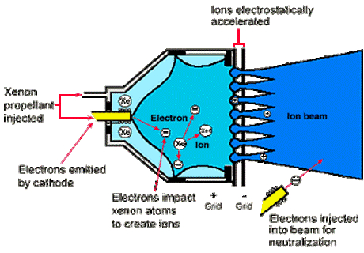
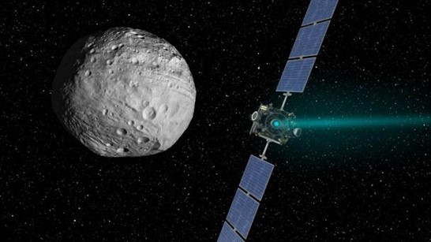
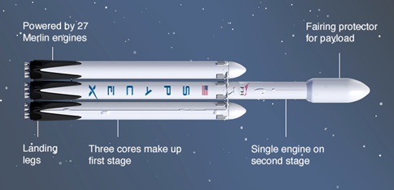
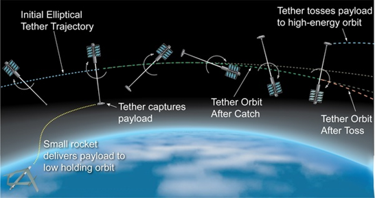
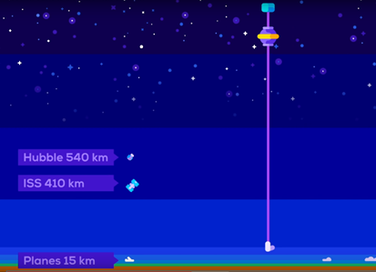
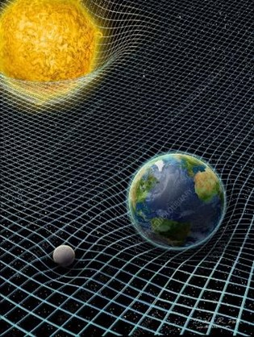
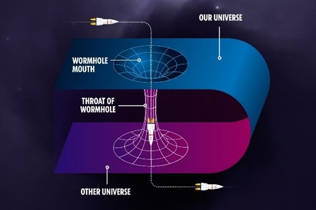
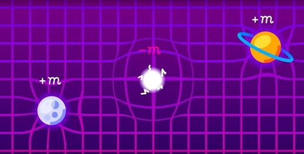

July 16th, 1969. Apollo 11 had just launched from Earth, and was carrying on board the first people to ever land on the Moon. It was a pivotal point for mankind, and marked as one of the greatest achievements of space travel, paving the way for many more accomplishments. Over 50 years later, we stand once more, on a pivotal point like no other. We are on the cusp of being able to colonise Mars, discover the secrets of new galaxies, and commercialise space travel for all. Let’s have a look at some of the ground-breaking ideas that will help us make these dreams reality.

## Ion thrusters
Firstly, let’s look at rockets. We currently use chemical thrusters to reach space, combusting liquid oxygen with liquid hydrogen. Although it gets the job done, it is extremely inefficient, as most of the weight of the rocket consists of fuel, and only 5% [1] of it is the payload- the object we want to actually send to space. 

Fortunately, the future of rockets looks very bright, with lots of alternative fuel sources currently being proposed and researched into. As of now, the most successful projects are ones which use ion fuelled engines, better known as electric system engines, as they only use electricity to propel ions. Rather than lighting up liquid fuel to accelerate, ion fuelled engines spew ions at much faster velocities, and are significantly more efficient and longer lasting than chemical engines. The best chemical rockets have a fuel efficiency of around 35%, whereas ion rockets have an efficiency of 80-90%. [2]

    

</img>

    
In an ion thruster, an inert gas (usually xenon) is bombarded by high-speed electrons inside a discharge chamber. These high-speed electrons collide with and strip away the electrons from the xenon atoms, creating more free electrons as well as ionising xenon atoms into positively charged xenon ions (this is called an ionising event). This soup of positively charged xenon ions and negatively charged electrons is now in a state called plasma. 

Although this plasma has both positive ions and negative electrons, overall, the charge is neutral. This is known as quasi-neutral plasma. Electromagnetic fields and a high voltage are used to speed up and push out the ions from the discharge chamber and out of the thrusters at very high velocities, accelerating the spacecraft. Once out of the thrusters, an electron beam shoots out electrons in order to neutralise the xenon ions, so they don’t strip electrons from the spacecraft itself. The electromagnetic fields keep the extra electrons within the discharge chamber, increasing the ionising events, making it more efficient. They also minimise the electrons hitting the walls of the chamber in order to increase the engine’s durability. This whole system is powered by solar panels, so no battery or power system is needed, minimising the total weight of the spacecraft.

    
Although these ion thrusters don’t produce as much thrust as chemical rockets, and can’t yet be used to escape Earth’s gravity well, they can last for months at full throttle (until they run out of fuel). This makes them extremely efficient in space, where there’s no gravity or air resistance, and slowly accelerating a spacecraft for weeks adds up the velocity, allowing it to travel at incredibly high velocities after just a couple of weeks of constant acceleration.

    

</img>

A chemical rocket has a maximum velocity of around 40,000 mph. On the other hand, ion engines reach a velocity of 100,000mph, and NASA is researching and developing an ion engine which can theoretically reach up to 500,000mph. [3] Ion engines are already used in many satellites in order to keep them in orbit, and were used to propel NASA’s Dawn spacecraft (launched in 2007) deep into our solar system. Dawn was the first spacecraft to orbit two objects in the asteroid belt between Mars and Jupiter: The protoplanets Vesta and Ceres.

    
To summarise, chemical engines are used up very quickly. The Falcon Heavy is about 550 metric tonnes, and 400 metric tonnes of it is fuel. This fuel is entirely consumed in 9.5 minutes [1], at which point the payload is in space.

    

</img>

However, spacecraft utilising both chemical rockets to enter space, and ion engines to gain additional velocity in space, can reach Mars in just over a month, cutting travel times by nearly 90%. Ion engines hold lots of potential, and NASA are in the final stages of testing and improving their endurance and reliability, so we can use them on manned spacecraft.

## Sky hooks
We already know that even though chemical rockets are our only way of going to space, they are very expensive and relatively inefficient. Luckily for us, there could be another way to go to space: Skyhooks.

Skyhooks are a simple and extremely effective method of sending objects into space. Currently, a rocket has to travel about 400km to deliver a payload into low orbit, such as the ISS. This takes a considerable amount of fuel and money, even more so if you are trying to fly to another planet. A skyhook could make it so you only have to fly 20% of the distance, and the skyhook would throw you into space. 

    

</img>

    
But what actually is a skyhook? Put simply, a skyhook is a giant spinning tether, with a counterweight on it. This superstructure would have two ends, the lowest about 80km above earth’s surface, and the highest about 1000km above earth. The craft would dock to its tether at the lowest point, and gain angular momentum as the skyhook rotated, as well as orbiting earth. 

Once the tether has reached its highest point, the craft would be released and propelled into space, carrying extra velocity from the skyhook. This not only reduces the fuel needed to send satellites and such into space, but also allows us to travel quicker and further, as almost all fuel is used to get out of Earth’s gravity well.  If we can use this alternative, we can conserve our fuel and use it to travel in space itself faster. We can even build skyhooks to orbit the Moon, or even Mars, using one of its Moons as a counterweight, and making a much larger skyhook to catapult us to the far depths of our solar system, at a much more affordable price and shorter time frame.

    
Despite this seemingly archaic idea to catapult things into space, the science behind the skyhook is sound, and it is even possible to create it with our current technology! There are many materials that are contenders to be used in the making of the tether, with a material called Zylon [4] in the lead. 

    

</img>

Zylon is extremely heat-resistant, a crucial feature as the bottom of the space tether is still in the Earth’s atmosphere, and will experience some air resistance and a lot of friction. Fortunately, at 80km above the Earth’s surface, the atmosphere is very thin and air resistance is bearable for the superstructure. Zylon is also over one and half times stronger than Kevlar, and barely changes length when put under intense tensions. All very useful properties to face space debris and endurance testing. Using the law of conservation of momentum, every time a skyhook sends a spacecraft into space, in order for the spacecraft to move faster, the superstructure will impart some of its own momentum on the spacecraft, slowing its own momentum. If this continues to happen, the skyhook will stop rotating and may even fall out of the sky and crash down to earth. This is why there will be small boosters (similar to the ones currently on satellites) to replenish the skyhook's momentum. Another way we can keep the skyhooks in the air is by doing the reverse of what we already do, as this would give energy to the skyhook, essentially replenishing its angular momentum. This would occur by “catching” high speed spacecraft in high orbit as they come back to Earth, slowing them down, and releasing them in low orbit. If done right, this can make skyhooks entirely self-sustaining, meaning they become more cost-effective the more we use them.

    

</img>

    
Since skyhooks can reduce the flight distance by about 80%, rockets can also be around 80% [5] smaller and considerably cheaper, although they will be remodelled so they can fly to and get caught by skyhooks. With the addition of skyhooks on other celestial bodies too, skyhooks could make future space travel cheaper and even commercialised, with planets such as Mars only one skyhook away. 

Skyhooks on a much smaller scale have already been tested and put into space, with great success, so it's only a matter of time before space agencies invest in creating these superstructures. With a bit of luck, and a lot of hard work, we may see the commercialisation of space travel happen very soon.

So far, we’ve seen technology that can be implemented within this century, with the concepts being very realistic. What about something more… theoretical?

## Introducing wormholes
Wormholes are a special phenomenon, which, according to Einstein’s theory of general relativity, could exist. They are essentially doorways to a different part of the universe, whether that be a few metres apart, or billions of light years away. Using Einstein’s theory of general relativity [6], we can see that the mathematics checks out, and that they can indeed exist. But just because something can exist in theory, it doesn’t mean it necessarily does exist in reality, and we have not (yet) found any naturally existing wormholes. But first, some explanation and context of what wormholes and general relativity are.

    
The theory of general relativity, simply put, is a way of describing how gravity works, and is our best description of it till this day. One key concept is how the very fabric of space-time works. Imagine if space-time is a trampoline. On its own, its flat, and there is no curvature. If I put a kettlebell on it, it will bend, and depending on the weight and shape of the kettlebell, it will curve differently. This is exactly how space-time works; objects such as stars and planets have a volume and gravity, and this gravity curves space-time. We already know that blackholes exist, and that they have such a strong gravity, warping space-time to the point where even light, the fastest thing in the universe, cannot escape its grasp.

    

</img>

    

</img>

    
But what if we took the trampoline and curved it so much that two opposite ends meet, and then we punch a hole through that? This is what wormholes do. They warp space-time so much that the space-time between two far apart places creases in on itself, and upon creating a hole through this crease, you have essentially closed the distance to virtually nothing.

Another way of visualising this is if you think of the universe in 2D, as a big flat sheet. If this sheet is bent in just the right way, a wormhole can be created through the sheet. This method is technically faster than the speed of light itself, as you have taken a much shorter route.

As you can see, even though the maths behind wormholes checks out, in reality it does sound like science fiction. But what if instead of looking for wormholes, we try something crazier. We could try to make them ourselves.

    
In order to create a traversable wormhole (a wormhole we can freely travel through back and forth), we need three main criteria. Firstly, we need them to connect two distant places, such as Earth and Saturn. Secondly, they should have an entry and exist, without any event horizons, like blackholes, as that would make travel impossible.

    

</img>

Lastly, they need to be big enough so that humans can travel through them without the G-forces killing us. The hardest part will be to keep our wormholes open. No matter how big our wormholes may be, the gravitational forces acting on the wormhole will be so strong that it will always be forced closed, unless we have some material that is strong enough to go against gravity to keep it open. This material has to have unique properties; the properties of exotic matter. Exotic matter is nothing like any matter we have seen previously, or even antimatter, which consists of the antiparticles of the particles of mass. Exotic matter has negative mass, meaning it will be able to repel any matter, and essentially repel against gravity itself. Surprisingly, this doesn’t introduce any violation of the laws of conservation and energy, and are still mathematically consistent. This would be able to hold up our wormhole, and make not only space travel, but any sort of travel at all, reach new and unprecedented heights. There are even some exotic atoms and exotic hadrons, as well as other elements which may possess the properties of exotic matter. [7] However, some scientists believe that if you can travel faster than the speed of light, that means time travel should be possible, and this would break our fundamental laws of physics. For this reason, many believe that not wormholes cannot be found or created.

For now, wormholes exist only on paper, and in our dreams. But the future is a mystery, who knows what we could achieve later on… only time can tell.

## Conclusion
The future of space travel knows no bounds, and an exciting world awaits us. From the ongoing projects of ion-engines to the dream of creating wormholes, who knows what we can do. Perhaps ion engines will make travelling to Mars as easy as catching a train, or skyhooks will let us travel to the Kuiper belt, where we can mine alluring new minerals, and even find exotic matter needed to open wormholes. The sky truly is the limit… or is it?

<h2>Bibliography</h2>

[1] https://www.spacex.com/vehicles/falcon-heavy/

[2] https://www.nasa.gov/centers/glenn/technology/Ion_Propulsion1.html

[3] https://www.youtube.com/watch?v=CiWb44VRZGo&t=220s&ab_channel=Seeker

[4] https://www.fiberbrokers.com/technical-materials-recycling/all-about-zylon/#:~:text=Zylon%C2%AE%20(or%20PBO%20fiber,1.6%20times%20stronger%20than%20Kevlar.

[5] https://www.youtube.com/watch?v=dqwpQarrDwk&t=179s&ab_channel=Kurzgesagt%E2%80%93InaNutshell

[6] https://www.space.com/20881-wormholes.html#:~:text=The%20wormhole%20theory%20postulates%20that,the%20theory%20of%20general%20relativity.

[7] https://www.youtube.com/watch?v=lzoYmLTrQ_8

