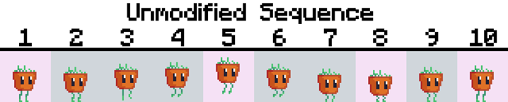
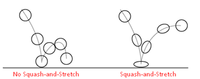
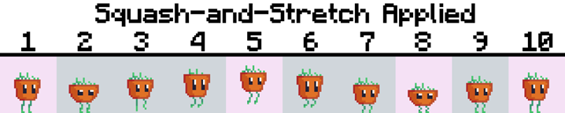
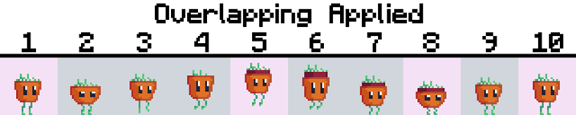
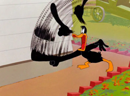

Animation is the process of using consecutive images (known as frames) to simulate a moving sequence on screen. Just like any form of art, learning to animate can be a long process that takes time to learn. I think some of us could agree that if you’re trying to teach the theories of an art, it’s better to use visuals rather than long texts so this awesome guide will use pictures to support the theories. 

Before you start animating a scene, you need to picture what sort of motions are involved and you break them down to the fundamentals. If you want to animate a human running, your first instinct must be to identify the Key Poses in this movement. When do both legs stretch out the most, or when does a leg go back to its default pose? Creating a rough animation with only a few Key Poses may also help you see what needs to be changed so you don’t end up fixing major errors when you begin to create the In-between Poses later on.

    
<iframe src="https://giphy.com/embed/ODSVUIord8z2WqNTst" width="200" height="200" frameBorder="0" class="giphy-embed"></iframe>

    <em class="centre">Take this lil guy I made, we’ll be using a simple jump sequence featuring him to demonstrate some of the theories discussed in this article.</em>

    
</img>

    <em class="centre">Frames 1, 5, 8 and 10 represent the Key Poses of the sequence, although you could argue 2 is also a Key Pose</em>

If you were to take the sequence out of context, with only the Key Poses, you would still be able to get a basic idea of what the sequence is about. I like to think of Key Poses as the default poses and the “extreme” poses, where the extreme poses would be the ones with the most change from the base poses. You can see that Frame 5 presents a drastic change to the default pose as the legs are fully stretched and the character experiences the greatest change in position.

Besides the leg movement, the sequence above still looks very static: the main body is pretty much just sliding up and down. When a person applies any form of movement, we would always expect their body to react to that motion in some way. 

One way we could present recoil on the main body would be to use a technique called __Squash-and-Stretch__, a common technique used to exaggerate motion and make it more visible. You could imagine a character as being an elastic object: a default pose is like an unstretched rubber ball and applying a force to it would squash the features of the character, then removing that force would cause the character to stretch before going back to the default pose. 
 
 

    
</img>

    <em class="centre">Squash-And-Stretch by Ralph A. De Stefano</em>

If we still consider the idea of elastic objects, we know that some materials are more rigid than others so they are less flexible. Depending on how much stretch an object experiences when they move could be used to demonstrate their weight and stiffness. If your object is very stretchy it could imply that they’re soft, otherwise the object is sturdy. It’s not natural for an object to be able to stretch over an infinite distance. So, when you’re applying Squash-and-Stretch, try to keep size proportions believable, which is normally done to keep the object’s volume consistent. Therefore, the amount of squash should be perpendicular to the amount of stretch.

    
<iframe src="https://giphy.com/embed/3FtLPf5Luy1YsL8l6O" width="200" height="200" frameBorder="0" class="giphy-embed"></iframe>

    
</img>

    <em class="centre">Look at Frames 2 and 8, where the body gets squashed the most. Let’s assume that squash reduces the vertical height by 4 pixels—so we would want to stretch the body horizontally by 4 pixels to maintain the volume of the shape (2 pixels to the right, and 2 pixels to the left).</em>

This looks more expressive than before since the character’s main body now shows impact from the jump. We could still do better by improving on the movement of the smaller details to give more energy to the character animation. An aspect of the design I decided to improve on was the soil part of the character, as after all, he is a sentient pot-being. One goofy little change would be to make the soil move up and down when he jumps and falls.

We could suggest that based on the character design, the amount of soil that he carries is probably not as heavy as his main pot body therefore they both have different weights. With that in mind, it’s safe to assume that the main body would fall at a faster rate than the soil. In other words, there is an offset between when both of these things would move. This behavior is normally called __Overlapping__ or __Overlapping-Action__ which is commonly associated with __Follow-Through__. Follow-Through is the idea that some parts (or limbs) attached to a main body could continue to move even after the main body has halted. Another way of looking at how these two things work would be to imagine exaggerating inertia. Realistically the connected part should move at the same pace as the main body due to inertia, however, Overlapping and Follow-Through applies a delay in movement of the connected part.

    
<iframe src="https://giphy.com/embed/LlkoHQ0pL4Fjsfs745" width="200" height="200" frameBorder="0" class="giphy-embed"></iframe>

    
</img>

    <em class="centre">If you look at Frame 4, you can see how the grass hair is shorter than the other frames. This is because even though both the main body and the soil experience the same force, the soil moves upward slower. Frames 5 to 8 display Overlapping and Follow-Through the most in the sequence. In Frame 5, when the main body reaches the peak height, the soil continues to move higher. The following frames demonstrate the difference in falling speed between the two objects.</em>

This final section of the article can’t be done properly using our sequence because there isn’t really any quick movement involved. However, I think it’s a really useful skill nonetheless as it may help reduce the workload immensely.

In animation, it’s difficult to have the time and resources to make our movement super smooth and we don’t need to (for the most part)! If the changes are so small between a frame and its previous frames, there’s no reason to spend a lot of effort trying to perfect each and every one of them. You don’t want to end up creating 1000 frames to make the smoothest animation but you also don’t want too few frames to cover that sequence. It’s pretty subjective on what is “enough frames” for a sequence, since that depends on personal preference, but just avoid spending too long on it—otherwise you end up stagnating at one little shot in your project.

Most animated films typically run on 24-30 frames per second, so it’s generally hard for anyone to notice any minor changes between the current frame and the previous frames. So, one method to save money and development time is through the use of a technique called __Smearing__, which is applying motion blurs on our animation. Be aware that smearing frames look weird on their own. Some examples of smearing:

    

<iframe src="https://giphy.com/embed/BndJJCXqdANurcPcEq" width="200" height="200" frameBorder="0" class="giphy-embed"></iframe>
<em>3D Smearing Example : Candyman from Lethal League Blaze</em>

    

</img>
<em>2D Smearing Example : Daffy Duck</em>

Motion blurs occur when we try to maintain focus on a fast-moving object. It’s impossible to spot every change in our view so our brains extrapolate the movement which results in the object looking smudged to us. A use of smearing would be in consecutive frames that look too alike, you could essentially reduce the number of frames to a few and smear those frames afterwards. There are a lot of creative ways you could implement smearing. One of them is to use smearing to highlight the strength of the movement, like using thick blurs at the end of a moving sword to show a heavy slash. 

Hopefully this small guide has been helpful in informing you about some of the techniques you could use in animation.

<h2>References</h2>

Overlapping-Action by Alan Becker: https://www.youtube.com/watch?v=4OxphYV8W3E&ab_channel=AlanBeckerTutorials

Pose To Animation by Jazza: https://www.youtube.com/watch?v=VcBwDHx_oDk&ab_channel=Jazza

Overlapping-Action Guide by Animation Mentor: https://www.animationmentor.com/blog/follow-through-and-overlapping-action-the-12-basic-principles-of-animation/

Squash-And-Stretch by Animation Mentor: https://www.animationmentor.com/blog/squash-and-stretch-the-12-basic-principles-of-animation/

Animation Smearing by IdeaRocket: https://idearocketanimation.com/8857-animation-techniques-smear/

Squash-And-Stretch by Ralph A. De Stefano:  https://www.evl.uic.edu/ralph/508S99/squash.html

Follow-Through and Overlapping Action by Ralph A. De Stefano: https://www.evl.uic.edu/ralph/508S99/follow.html

