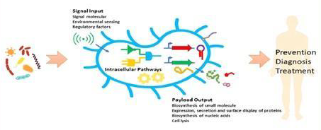
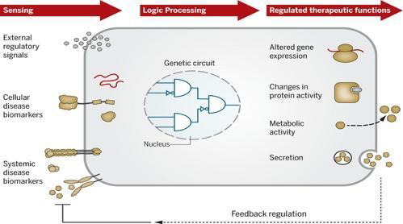
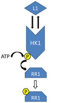
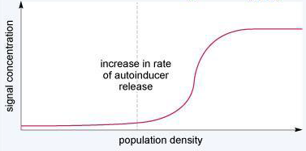

## Societal use of genetically modified (GM) bacteria in medicinal treatment:

In the age of modern medicine, with the pervasive reach of over-the-counter treatments, we have a traditional perception of pharmacological agents, as orally administered tablets or oral/intravenous fluid medicines.  When asked to imagine a typical therapeutic agent, our ideas often spring to ‘white pills’ or ‘strawberry flavoured Calpol’. However, within the realms of biological synthesis lies a promising category of future treatment – in vivo manufacture and delivery of therapeutics via <u>genetically modified bacteria</u>. Whilst still in its relative infancy, its potential is derived from the ability to harness the natural metabolic and genetic cycles of the therapeutic bacteria, influencing its interaction with the human cellular environment, its specificity to the disease cell target and the synthesis of therapeutic agent to be deliver to the diseased cell. In a time of precision medicine, where scientists are searching to amplify and improve drug-target interaction, this innate capability of GM-bacteria is of paramount importance. 

In its essence, the purpose of a medicinal drug is the selective elimination of diseased cells (or disease causing compounds), in conjunction with minimal damage to the surrounding tissue. This is a longstanding principle with origins rooted in Ehrlich’s ‘Magic Bullet’ - a term he used to describe the concept that chemicals could be designed to bind to and kill specific microbes or tumour cells. Hence, when designing the mechanisms of a GM bacteria drug delivery system, the pharmacological necessities of efficient therapeutic delivery must first be outlined. 

These include: 
- an optimisation of therapeutic effect and reduction of side effects via specificity of the therapeutic to the target site, resulting in high concentration at the target and low concentration in non-target areas
- a predictable drug release pattern, with minimal leakage during transport
- easy bodily elimination of the drug
- non-toxicity, non-immunogenicity, biodegradability, biochemical inertness, biocompatibility and physicochemical stability in vivo and vitro. 

Supplementing these core foundations are multiple other factors, influencing the success of in vivo bacterial delivery. Such benefits are again derived from the precise attack mechanism, meaning a lower drug dosage is required, in turn reducing any subsequent side effects. Further to this, by genetically defining the precise intracellular production process, both the need for product purification is removed and the capability for combination therapy (i.e. the synthesis of multiple drugs by a singular bacterium), is introduced, engendering greater efficacy and efficiency of treatment.

    

</img>

    

</img>

## Drug Delivery Mechanisms in Bacteria:

The mechanism can be subdivided into three key components: targeting the diseased tissue once the drug is within the localised area, production and delivery of the active compound, and termination of treatment. Enabling these stages are complex genetic circuits, constructed in the bacteria prior to bodily entry, that result in altered metabolic pathways that not only synthesise the desired protein but code for sensing, signalling and lysis in the delivery system.

### 1. Targeting of the specific disease site:

Before direct targeting of the disease site can occur, the bacterial complex must first enter the body, which in some cases is by a singular subcutaneous injection to the localised area of the disease.

In a healthy cellular environment, there is a constant influx and output of chemical signals and compounds, maintained by the instruction of each cell’s genetic code. However, when an infectious agent enters a cell, or genetic mutations arise (as with disease), the regular input-output signalling patterns are disrupted, resulting in different, prominent compounds or trends, termed _biomarkers_. The targeting process itself, from the localised area to the specific cells, requires high sensitivity of the bacterium to the correct area, hence it is these disease specific cellular markers, which the bacteria are genetically programmed to attack. Central to this process is the detection and response of the bacteria to the distinct environmental biomarkers of the disease site - these can be in the form of small bioactive molecules produced by the host cell, such as cytokines and enzymes or alternatively growth factors on receptor cell membranes. Within the bacteria, such detection systems are genetically engineered, often through the manipulation of innate bacterial sensing systems to make them responsive to the desired stimulus - hence attracting the bacteria, and eventually the therapeutic, to its target. Once the therapeutic bacterium interacts with its specific biomarker, an internal signal is sent (within the GM bacterium), indicating the target has been reached and delivery of the therapeutic can occur.

One such example is the natural __‘two component system’__, that allows bacteria to sense and respond to environmental stimuli. This is composed of two types of proteins: histidine kinases (HKs) on the bacterial cell surface membrane and response regulators (RRs) within the bacterial cell. When a signalling molecule, released by a diseased cell, binds to the HK on the bacterial surface membrane, a process called ‘autophosphorylation’ occurs, whereby a phosphate group is transferred from the HK to the RR protein within the bacterium. This transfer of the chemical information or ‘signal transduction’, activates the RR by causing a conformational change. In turn this enables it to bind to complimentary sites on the DNA of a relevant _promoter sequence_ – a DNA sequence that determines where transcription of a gene begins. Transcription of these specific sites will then occur within the bacterium.

This process can be modified to suit the context of bacterial drug delivery. Firstly, the HK proteins of the therapeutic bacterium are engineered to sense the specific environment of the disease, achieved via altering their genetic expression so they are specific and complimentary, to the external biomarkers. When the biomarker molecule then binds to the HK protein, this signals that the bacterium has reached the correct location and it is communicated to the bacterial internal RR protein via autophosphorylation. The bacterial RR protein can be similarly genetically modified, so that when binding of the phosphate group occurs, a new conformational change arises. This altered shape will be specific to a different promoter sequence, resulting in the transcription of different genes and hence different outcomes such as bacterial lysis and subsequent release of the therapeutic protein.  

    

</img>

    

</img>

    

</img>

<em>The ‘Two component system’ mechanism in bacteria</em>

Alternatively a process called __‘quorum sensing’__ (QS) can also be harnessed. The basic principle is as follows. Bacteria monitor their population level via the secretion of specific ‘autoinducer’ (AI) molecules – the greater the population density, the greater the concentration of AI secreted. Once the AI concentration reaches a certain level or ‘quorum’, the molecules bind to a transcriptional regulator, which activates the transcription of specific genes. 

In the context of in vivo targeting, if the host cell disease is caused by a bacterial pathogen, the QS device of said pathogen can be integrated with the QS system of therapeutic manufacturing bacteria. In this way the level of AI produced by the therapeutic GM bacteria corresponds to the density of the pathogenic bacteria in the diseased cell, rather than the numbers of GM therapeutic bacteria. The result of this is that the level of autoinducer secreted by the GM therapeutic bacteria is then related to the number of pathogenic bacteria surrounding it. Therefore, as the GM bacteria near the target, the autoinducer concentration increases relative to the severity of pathogenic bacterial infection, triggering the transcription of genes that result in the breakdown of the therapeutic bacterial membrane and allowing the release of the therapeutic compound – a process known as _quorum lysis_. Additionally, when other sensing systems are in place, quorum lysis can be used without integration of the QS device from the pathogen. This triggers the release of the therapeutic agent when the therapeutic bacterial population increases and is reflected in the concentration of medicinal compound release. 

    

</img>

    

</img>

    

</img>

<em>‘Quorum sensing’ mechanism in bacteria</em>

### 2. Production and delivery of the active drug:

Production of the compound occurs throughout the delivery process and is again controlled by genes inserted into the bacteria’s genome that express the desired therapeutic protein – a process known as heterologous expression. In its essence, it entails the introduction of complementary RNA or gene clusters, to the bacterium’s own RNA, such that its cellular machinery expresses this foreign protein. This modification is present inside each of the therapeutic bacteria being used for treatment, such that their population density will therefore affect the level of compound released into the body, making it an important factor to control. In some circumstances the compound synthesised inside the bacterium is already in its active state, needing no additional alteration to its structure. However, in other cases the therapeutic manufactured is only a ‘prodrug’, requiring the further production of an enzyme or protein to convert it into its active, toxic state, once a signal is received that the target site has been reached. 

The second stage of this process is the release of the active compound, which, as discussed, is linked closely to the sensing mechanisms of GM bacteria and the genetic circuits controlling them. Once signals are transmitted that the target site has been reached and infected, certain gene clusters within the therapeutic bacteria are activated that allow for the release of the therapeutic agent (a drug). This can occur in two ways: via direct lysis of the bacterial membrane (as employed in quorum lysis), or through the use of specific transporter proteins that secrete the compound into the diseased cell. 

### 3. Termination of treatment:

The final stage of this process is the termination of treatment, involving either the death of the GM therapeutic bacteria (via direct lysis or other methods), or by prevention of compound secretion. Most frequently this occurs via the integration of a ‘switch off’ gene in the therapeutic bacterial system, which prevents further compound production. Other routes of termination are also being explored, such as ‘thymineless death’, a phenomenon whereby bacteria cells, when no longer supplied with thymine, undergo cell death. This can be programmed into bacterial strains by deletion of ‘thymidylate’ synthesising gene. However, the direct mechanism for this process is still unknown, reducing its viability. 

## Safety of treatment:

Although an effective way to ensure continuous therapeutic production, without the need for repeated injection or reapplication of the drug, there are certain caveats with the process which are still being addressed.  Common to every treatment are side effects that can implicate its safety. With regards to treatments involving genetic modification it is the genetic engineering element itself that often poses the greatest issue. Therefore, when using GM bacteria as in vivo drug factories manufacturers, the engineering of the genome and control of genetic material must be carefully monitored. 

The most prominent risk is that of horizontal gene transfer, which involves the physical movement of genetic material between bacteria - this is in contrast to vertical gene transfer which is the sharing of genetic information between parent and offspring organisms. Horizontal transfer can occur through transformation, (the uptake of free DNA), conjugation (transfer of plasmids between cells) and transduction (transfer of genetic information by a viral vector or ‘bacteriophage’). This sharing of genetic information with bacteria, either in the natural flora of the human body, or in the outside environment can lead to transgene cells, which may have unpredictable interactions with the rest of the body’s microbiota or external organisms. In turn this could lead to unknown, potentially harmful, side effects. Moreover, this type of transfer can induce the spread of antibiotic resistance genes, hence posing a threat to the efficacy of other treatments. However, one scientific method of combat lies in the engineering of GM bacteria without free plasmids, to remove the risk of genetic transfer. 

    

</img>

    

</img>

<em>Horizontal gene transfer</em>

                                                  
## Closing words:

To conclude, the use of genetically engineered bacteria as in vivo drug synthesis and delivery vehicles has huge potential for success in the treatment of common diseases, especially given the rising importance of precision medicine and whilst there may still be points of contention surrounding the fine minute control of genetic information, progression in the field of genetic engineering technology, will no doubt enhance the prospects of the technique to target disease in the future. 

<h2>Bibliography</h2>

- Urquhart, J. (2022) Encapsulated bacteria show promise as injectable living drugs factories to treat diseases, Chemistry World. Chemistry World. Available at: https://www.chemistryworld.com/news/encapsulated-bacteria-show-promise-as-injectable-living-drugs-factories-to-treat-diseases/4015859.article (Accessed: 2022). 
- Han, Y. and Zhou, Y. (2022) Engineered bacteria as drug delivery vehicles: Principles and prospects, Engineering Microbiology. Elsevier. Available at: https://www.sciencedirect.com/science/article/pii/S266737032200025X?via%3Dihub (Accessed: 2022).
- Wegmann, U. et al. (2017) Use of genetically modified bacteria for drug delivery in humans: Revisiting the safety aspect, Nature News. Nature Publishing Group. Available at: https://www.nature.com/articles/s41598-017-02591-6 (Accessed: 2022). 
- Promoter Definition (2014) Nature news. Nature Publishing Group. Available at: https://www.nature.com/scitable/definition/promoter-259/ (Accessed: 2022). 
- Morgan, K. (2014) Plasmids 101: The promoter region – let's go!, Addgene blog. Available at: https://blog.addgene.org/plasmids-101-the-promoter-region (Accessed: November 2022). 
- Gagnon, K. (2009) Measuring electroneutral chloride-dependent ion fluxes in mammalian cells and in heterologous expression systems, Physiology and Pathology of Chloride Transporters and Channels in the Nervous System. Academic Press. Available at: https://www.sciencedirect.com/science/article/pii/B9780123743732000091?via%3Dihub (Accessed: December 2022). 
- Claesen, J. and Fischbach, M.A. (2014) Synthetic microbes as drug delivery systems - ACS Publications, ACS Publications. Available at: https://pubs.acs.org/doi/10.1021/sb500258b (Accessed: December 2022). 

