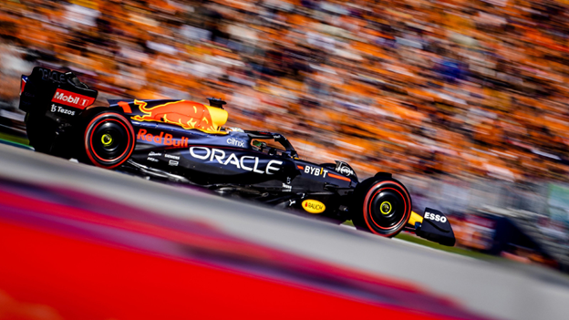
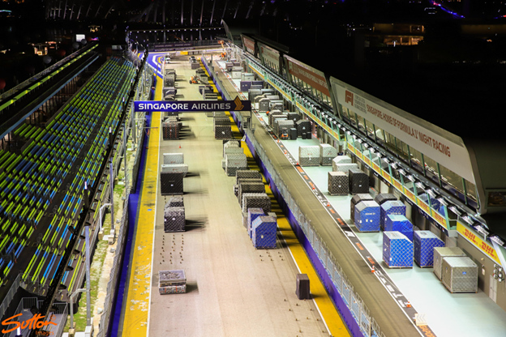
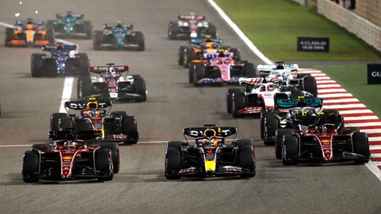

Formula 1 is a truly international sport. The 2023 season is set for a record-breaking 24 races, in 21 different countries, on 6 different continents. The season calendar packs these races into just 9 months of the year, with multiple race events on back-to-back weekends (known as double headers). 2023’s calendar features the first time three races are run back-to-back-to-back in a season twice (known as triple headers). The task, then, of transporting the equipment, cars and personnel to tracks around the world, for nearly half of the weekends in the year presents a massive logistical problem for the teams and for DHL, F1’s official logistics partner. 

</img>
<em></em>

The logistical planning process for each season starts around the same time the official calendar is released, as teams need as much time as possible to ensure they can create back-up plans in case the calendar abruptly changes, such as with the removal of the Russian Grand Prix following Russia’s invasion of Ukraine. Usually, if the calendar is changed, it is because races are removed, which makes logistics easier, as teams gain an extra week. Due to China’s zero-Covid policy, it has been removed from the 2023 calendar, and various European races are in debate to take Shanghai's spot, which creates a minor problem for the logistics teams. Larger issues, such as 2020’s truncated 17-race calendar brought about in a couple of months, present a much greater problem than adapting to one altered race weekend. The reason behind this is due to the time constraints placed on the teams to adapt to changes, and the sheer amount of equipment and personnel they must transport to every race.

A race weekend lasts from Friday morning to Sunday afternoon on track, but it starts a few days earlier for the logistics team.  Each team brings 2 cars and a host of spare parts to each race from their base. All but one team are based in Europe, with 5 in England, 2 in Italy, 1 in Austria and 1 in Switzerland. The final team, Haas, are based in North Carolina, but operate a forward base in England. Every part on the car must return to the team’s HQ after every race, for a process known as Non-Destructive Testing (NDT), where they are analysed for safety and performance. This is a fairly easy process when in Europe, but the process creates a few issues when the race takes place outside of Europe. Each part needs to be flown back to base and then to the next race, ready to be assembled and raced from Friday morning.

The 60-75 strong trackside crew (which varies between teams) consists of a team principal, the drivers, mechanics and pit crew, engineers and personal trainers for the drivers. They usually return home if the journey is short, or stay in the country if they are far from home. Travel is primarily done by truck in Europe, where roughly half of the races are held, as it is far cheaper than flying. Trucks also produce far less emissions than planes, something Formula 1 is conscious about, as part of their Net Zero 2030 plan is to reduce Formula 1’s carbon footprint. “Fly-away” races (those that take place outside of Europe) require planes to make it in time for the next race. While shipping via sea is much cheaper and more environmentally friendly, it is also much slower.

Teams prepare what are known as “sea kits”, a set of shipping containers that contain non-essential equipment for race weekends, such as kitchen appliances, tables, chairs and some elements of their garages. Five to six sea kits are prepared in January and sent out to the first five or so fly-away races - in 2023 these will be Bahrain, Saudi Arabia, Australia, Azerbaijan and Miami, unless China is replaced by another fly-away race. When the first race is done, the sea kit is packed up and sent to the next fly-away race - in the case of 2023, Bahrain’s kit will be sent to Canada. This reduces costs and emissions on the non-essential parts of the team’s overall equipment. They could theoretically race without their sea kit’s equipment, though it might be a bit uncomfortable, as they contain some equipment used in their motorhomes. 

Each team uses a motorhome for the race, which in reality are usually multi-storey pop-up buildings - Red Bull’s motorhome is 3 stories tall, except for their special water-borne Monaco motorhome, which is required due to the lack of space in the principality. The alternative would be using a hotel, which is often provided on-site for fly-away races, negating the use of a motorhome for sleeping purposes. However teams still take them as they serve as office space and a place to take some rest, vital for the drivers to ensure they perform as well as possible. These motorhomes are either in the sea kit, or transported by truck from race to race in Europe.
Ideally, the logistics team has 2 weeks to transport all the equipment from race to race. However, 2023 features 6 double-headers and 2 triple-headers, with every race bar one in the second half of the season being part of either a double or a triple header. This places an incredible amount of stress on the team, especially the logistics team. They have from Sunday evening to midday Wednesday to transport all their equipment thousands of miles and set it up, ready for the next race. 

</img>
<em></em>

With no time to waste, the teams are packing before the chequered flag has fallen, putting spare parts into trucks, ready to go to the airport - the teams won’t swap an engine or gearbox mid-race. Once the race has ended, the teams really get moving, taking apart the garages, motorhomes and cars, and putting them in trucks. The garage parts, most of the motorhomes and the cars go to the airport, ready to fly to the next race or the team’s base (in the case of the cars), while the non-essential parts are put back into their shipping containers. This is usually achieved within six to eight hours after the race has ended. DHL’s Boeing 747s then fly to the next race by Monday morning - six are required for the equipment of the ten F1 teams. The staff also begin the journey to the next location on Monday too, to give them time to accustom to the new timezone and shake off jet-lag. Timezones can help or hinder the teams - Azerbaijan is 9 hours ahead of Miami, giving the teams an extra 9 hours, while Abu Dhabi is 12 hours behind Las Vegas. By the time the race ends in Las Vegas, it will already be Monday in Abu Dhabi.

The planes land at the airport, and the cargo is put onto trucks, ready to go to the tracks. The three priority pallets are delivered first - these contain the necessary parts to assemble the garage, which is the first set of equipment to be packed away once the previous race ends. Teams are not allowed access to the track until all the teams priority pallets have been delivered, to ensure fairness. DHL staff handle the pallets instead of the team's crews, delivering them overnight to the track. Once the pallets have been delivered, teams put up the core of their garage on Tuesday, such as the electrical systems and the IT equipment. They then leave the track as the rest of the team’s equipment is brought in, and on Wednesday they complete the garage build, as well as assembling their motorhomes and cars. The garages are operational by noon on Wednesday, despite still being in the air on Monday evening, demonstrating just how quick and efficient Formula 1 teams are off-track. This gives the team a day to rest, ready for the first free practice session on Friday morning.

Every F1 team, alongside DHL, pulls off this trick every race, almost without fail. Small hiccups sometimes occur, for example, technical issues stalled a plane in 2021, causing Haas to lose out on two days of pre-season testing before the season started. However, 2020 presented a much larger challenge than one grounded plane. In fact, almost every plane around the world was grounded.

COVID-19 presented a massive problem for the logistics teams in 2020. The pandemic affected the season opener in Australia, resulting in many fans stuck outside of the track with tickets that would no longer let them in to watch the race. The issue quickly grew as the virus spread, causing F1 to draft a new calendar. It was confirmed in June, and it started on the first weekend of July. This gave the teams a singular month to plan for a daunting 17 race calendar. Luckily, the sea kits were sent off in January, and were in place for all the races they were required for. To aid the logistics teams further, 6 races were double headers at the same track - the Austrian and Styrian Grand Prix at the Red Bull Ring, the British and the 70th Anniversary Grand Prix at Silverstone, and the Bahrain and Sakhir Grand Prix at the Bahrain International Circuit. However, the calendar still featured tricky double-headers such as Bahrain to Abu Dhabi and a semi-regional triple-header from Monza to Mugello to Sochi (both Monza and Mugello are in Italy). The lack of planning time meant the teams leaned heavily on their logistics teams to sort out all the issues to deliver racing behind closed doors for the fans at home. 

</img>
<em></em>

Overall, the pandemic was managed, though not without complaints from the teams over the lack of time given to adjust to the new calendar. Similar complaints have come up recently, following the announcement of 2023’s 24 race calendar, with many teams worried about the toll taken on their employees, as they will be unable to return home for short stretches of time due to the amount of double and triple headers. Through a combination of teamwork, communication, and a large amount of experience, the logistical teams deliver the support necessary for the teams to participate in the championship, year after year. Without them, the races would not be possible, and they deserve as much support and appreciation as the teams and drivers receive.