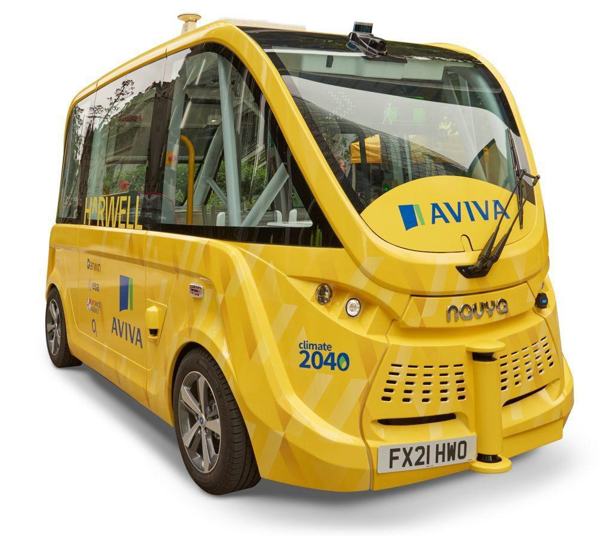
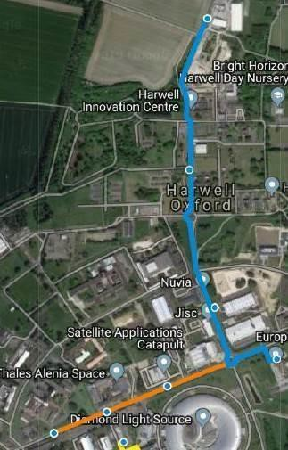
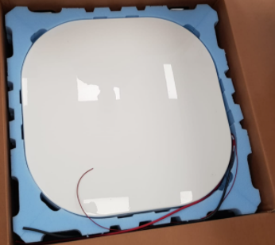
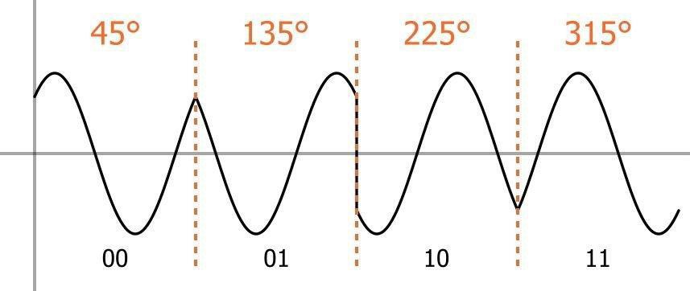
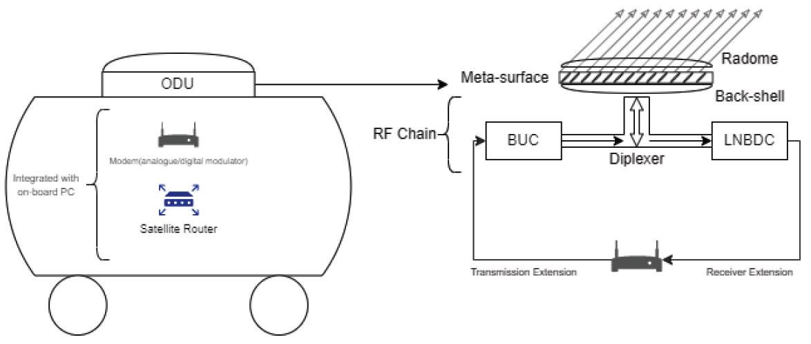

Imagine a network that never breaks no matter where you are. No more static calls. No more hotspots. No more turning your mobile data on and off in the feeble hope that YouTube loads.

It seems a utopian proposition at the least. But here’s a solution to one of our generation’s lesser evils. Join me for a short trip through the inner workings of the HVNO.

## What is an HVNO? 
_The Hybrid Virtual Network Operator_

Before we get to the HVNO, first let’s understand the 2 key components that merge to form this service. 

### Virtual Network Operator
A virtual network operator (VNO) is a network services provider and a reseller. VNOs provide telecom services by purchasing/loaning the required broadband from the main telecommunication giants (EE, Sky, Virgin Media) that own all the existing physical infrastructure between them. These network providers are classified as ‘virtual’ because they offer network services to clients without possessing the actual mobile network. VNOs lease bandwidth at agreed wholesale rates from said telecom giants and then offer services to their customers, as a result, they can sell plans and deals at a reduced cost for consumers of a certain financial/social/environmental disposition, such as VOXI (we’ve all seen the unlimited social media data ads).  

### The Hybrid Virtual Network Operator:
Contrary to existing VNOs, the HVNO offers an uninterrupted connection wherever you are using a Hybrid User Terminal that integrates a __Ground-Based Mobile Network__ (5G is the current standard for technology that requires a high rate of data transfer), and a __Satellite Network__ (a good example being the Starlink satellites).

Both the ground and satellite networks enforce each other. Say you took a hike from the towering favelas of Rio de Janeiro into the green canopies of the Amazon rainforest – the MVNO would switch to the SVNO whenever a drop in signal occurred. 

### What is it Good For?

The surveillance on transportation of high-value cargo between regions is a must for firms protecting their assets and liabilities, this is especially important in areas such as Latin America with the crime rate an ongoing problem for regional firms, insurance premiums increase the overall overhead costs of production, having this HVNO network will take great steps towards decreasing those premiums due to the reliability of constant communication with transport vehicles. 

The HVNO also eliminates the need for a large volume of vehicular capital in asset maintenance, with satellites overhead in isolated locations, and the use of AI about a singular vehicle to map out areas and check for objectives such as maintenance and environmental stability. 

From a military standpoint, a stable, private and reliable/unbreakable connection is invaluable in the field of both physical and cyber warfare. An example of just one component of the HVNO is the Satellite VNO provided by Starlink to the Ukrainian military in the defence of Ukraine once Russian cyber forces disrupted the regional mobile frequencies. A hybrid VNO will integrate the two network infrastructures and actively switch between the two to ensure an unbroken line of communication.

The case can also be made for individual private buyers (VIPs) with the means to acquire this technology to protect their properties and enjoy superior connection from the average user, past the even more expensive installation cost of private radio towers and mobile networks.

As you can probably tell, the initial stakeholders in these HMVOs will be those that are most willing and able to pay the high initial costs associated with this service.

## A Case Study – The Darwin Autonomous Shuttle:

    

        
</img>

    

    
The DAS is a fully autonomous people carrier and is currently being trialled on the roads in the Science & Innovation Campus in Harwell, Oxford. It is the first licenced, road-legal autonomous vehicle in the UK. The trial launched on 29 November 2021, in which, the DAS provides a regular passenger transport service to campus residents. The shuttle can accommodate 15 passengers (11 sitting and 4 standing) and is currently limited to 20 Km/h.

The current shuttle routes are shown below: 

    
This continuous, reliable service is one of the unique selling points of the DAS. Current public transport, namely buses, often suffer delays due to human error and require manual operation, which not only contributes to an expensive overhead but leads to inconsistencies in service and operation. The DAS offers a solution in its autonomous nature, it currently follows a set route around the Campus, stopping at campus bus stops along the way, allowing passengers off and on. Provided with a fully mapped out route for the shuttle to traverse. The shuttle has been programmed with this mapping information, to ensure it knows what to expect and what to look for.

    

        
</img>

    

Additionally, the shuttle is equipped with 2D and 3D LiDAR sensors, cameras, odometry sensors (used to measure the speed and angle of wheel rotation) and a GNSS (GPS) antenna to help it position itself and detect obstacles.

## Integrating the HVNO in the DAS – The Outdoor Unit

Of all the amazing technology and innovation packed into the shuttle, by far the most impressive technology is the Outdoor Units installed on the top of the Darwin Autonomous Shuttle.
 

</img>

### What is an ODU?

Is a satellite communications solution (this word is a catchall term for anything that does something in engineering) used to receive and transmit Shuttle telemetry to and from the Darwin Automated Shuttle or any vehicle that may require similar services.

Unfortunately, there is no emergency TLDR for those desperately averse to the fineries.

The process by which this communication occurs is as follows:
- Digital Information such as the 3D mapping of an area for shuttle travel is transferred through a __medium__ (anything that can act as a conduit of data i.e. wires/air) to the Satellite router & modem.
- The __modem__ modulates the information in a way that converts digital bits into analogue, electromagnetic radiation, which have been coded in a method called __Quadrature Phase Shift Keying__ (QPSK), in which the binary pairs of 1s and 0s are assigned to a phase difference:

    

        
</img>

    

    
There are alternative methods of modulative electromagnetic radiation, but QPSK is considered the most advanced as it allows for greater information transfer for the same bandwidth.

QPSK can be further complicated by adding more ‘keys’, this is done by shortening the phase difference between coded bits, leading to binary combinations in the powers of 2 (i.e. a 4QPSK will have 16 possible combinations, 0000, 0001…).

- _Why electromagnetic waves? E-mag waves do not require cables and an electric current to transfer data._
 

</img>

<em>A simplified model of the communications solution used</em>

- Once modulated, the data is transferred through a transmission extension to the Block Up Converter(BUC) this amplifies the band of frequencies from a lower frequency to a higher frequency(contrary to A-level physics knowledge, the frequency can be changed and still contain the same data). In this way, the radio frequency (RF) waves (in the microwave region with a typical centimetre to millimetre wavelength range, corresponding to frequencies of 10–60 gigahertz [GHz]) now has the power to reach the satellites orbiting the Earth. This is the transmitting component of the RF chain (See Below)

</img>

 
- The amplified E-mag waves are channelled through the __Diplexer__ (which enables the sharing of a common antenna between two distinct frequency bands, this is used as the port at which both incoming and outgoing frequencies go through). This is part of the __Feed Assembly__ (Above).

- Now to the __meta-surface__, this plays the role of directing the radio waves at the satellite moving in orbit. 

    

        
</img>

    

    
Meta surfaces are made up of liquid crystals in a glass-like structure, the molecules of liquid crystals are ‘tuned’ through the use of a potential difference on either side of them with a magnetic field running perpendicular to it, as shown; at 0 volts, the liquid crystals are compressed between the alignment layers and no radiation is allowed to be permeated through the meta-surface. As a potential difference is applied (which is done at a very small precision, even a degree of inaccuracy will result in the signal being sent miles wide of the satellite) the liquid crystals move in concert to allow a parallel beam of E-mag waves to pass through

- The __Radome__ and __Backshell__ are mainly to maintain the structural integrity of the ODU.
- With regards to receiving a signal back from the satellite( do not require meta surfaces as the curved nature of their dishes allows for a focal point to send data), once the waves have passed through the atmosphere into and through various physical obstacles, loss of power of the original signal is inevitable.
- To adapt to this, once the low energy waves have passed back through the diplexer, a __Low Noise Block Down Converter__ is used to receive a satellite signal, amplify it, and down-convert it to an intermediate frequency (IF) more suited to the satellite modem installed on the vehicle.

FINALLY:

- The analogue waves are then de-modulated via the modem into digital data to be collected and processed by the vehicle and observational entities such as the humble laptop.

To conclude, the HVNO has near unlimited uses and may well be introduced as the next generation of mobile networks in the near future. Where just 147 years ago with the revolution of the landline and telegraph allowing for the first transatlantic cable in 1858, it seems we are fast converging to a world devoid of buffering, loading symbols and unbearable ping.  

<h2>Bibliography</h2>

- https://sid.onlinelibrary.wiley.com/doi/10.1002/msid.1178
- https://www.kymetacorp.com/solutions/inside-the-terminal/
- https://darwincav.com/autonomous-shuttle/

