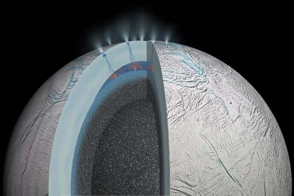
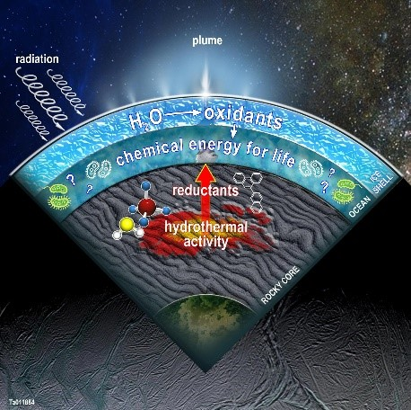
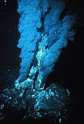

As humans, we’ve always wondered whether there could be life somewhere else in the universe. In fact NASA’s annual budget is $29.20 billion which mostly goes towards exploration of the universe beyond earth. The thought of having life outside our planet hasn’t become a likely possibility until recently. Therefore, now, instead of our idea about green aliens as the possible life elsewhere in the universe, researchers have found that smaller organisms, namely extremophiles, have the potential outside our planet. 

    

        
</img>

    

    
In the following article we will discuss how the possibilities of life outside the earth has become more of a reality due to the presence of an ocean on one of the satellites orbiting Saturn, called Enceladus. It has been found that the presence of certain ions as well as the saline level in the ocean water directly affects the possibility of life in this ocean ecosystem. 

The sixth largest moon of Saturn and one of the most reflective bodies in the entire solar system is Enceladus. With a rocky core that makes up the majority of the moon, Enceladus is covered by a global ocean trapped under a thick ice crust. The ice crust on Enceladus is thick enough to trap outer space radiation. This cosmic radiation, that includes high energy charged particles or x-rays and gamma rays, are harmful to any type of life. On Earth, our atmosphere protects life on Earth from cosmic radiation, causing life to be able to thrive. But on a moon such as Enceladus, which is very small, it is not able to sustain any atmosphere. However, since Enceladus orbits Saturn, it is far away from the sun, temperatures can fall down to -201 degrees Celsius. This means that any water on the planet should be ice (which is not exactly the case) yet not all of the water present is ice although there is a very thick layer of ice on the top of the planet. This thick layer of ice not only protects the moon from cosmic radiation, but it also makes Enceladus one of the most reflective bodies in our solar system. With the ice sheet covering this ocean world, Enceladus can sustain life without any cosmic radiation from destroying any life it creates. 

    

        
</img>

    

    
Enceladus is covered in a global ocean, under the thick layer of ice, making the moon into what is known as an ocean world. The global ocean on Enceladus is created by tidal heating. This occurs due to heating of a cosmic object (sun, satellites, asteroids, planets etc.) that orbits another cosmic object in the universe. Since Enceladus orbits Saturn, the gravitational pull from the planet causes Enceladus to flex, which slightly moves the ice and creates a global underwater ocean. The flexing of the moon causes the ice to slowly melt and create an underwater ocean - it also creates marks that can be seen on the ice above the ocean. This also causes the geysers or jets on Enceladus to be full of water, rather than molten rock (which is what would have been expected).

    
Deep under the surface of Enceladus, just as on Earth, the rocky core of the moon is filled with active hydrothermal activities. This allows for thermal activities on the moon. The fact that it is full of water, and due to the slight expansion of the moon due to tidal heating, allows for hydrothermal vents, just as those on Earth. The vents on Earth are filled with life, so this allows for the possibility of this kind of life to also be present on Earth.

    

        
</img>

    

Therefore, since there is liquid water and underwater hydrothermal vents on Enceladus, there is a possibility that there could be life here. The fact that life exists in hydrothermal vents on Earth suggests that there may be a possibility of extremophiles, such as chemotrophs, to live in these underwater vents on Enceladus, where the conditions are similar to the underwater vents on Earth. For example, in the vents there must be sources of sulphur and temperatures must be extremely high, such as those in the underwater hydrothermal vents. 

There are many different types of life on Earth such as plants, which are known as autotrophs, due to the fact that they are able to produce their own food via the process of photosynthesis. However this cannot occur in the depths of the ocean yet there are several organisms that are still able to survive in these conditions. Therefore there must be other processes which occur which have the ability to sustain life in the absence of sunlight. One such process is chemosynthesis carried out by organisms called chemoautotrophs. 

    
Chemoautotrophs can be split up into three parts, ‘chemo’ meaning chemicals, ‘auto’ meaning self and ‘troph’ meaning nourishment. Chemoautotrophs produce their own food for energy. There are two different groups of chemoautotrophs depending what type of compound they oxidise to gain their nutrition. If they oxidise organic compounds they are called chemoorganotroph whereas, if they oxidise inorganic compounds then they are called chemolithoautotrophs. Their ability to do chemolithotrophy is what enables them to live in harsh environments. For example the underwater vents present on Enceladus can reach up to 400°C where the pH is also extremely acidic. The most common chemotrophic organisms include bacteria and fungi and, since they are able to make their own nutrition, they are producers in most underwater food chains. 

    

        
</img>

    

The salinity of the oceans under the ice shell covering the satellite directly affects the thermal properties and tidal cycles of the ocean. If the ocean has too low a salinity there will be limited energy available making the possibility of it being habitable impractical. However Enceladus could have the appropriate level of salinity to sustain life. Hence the tidal cycles can be determined and monitored to show where the heat from the geysers and the ions are transported, which once mapped can show where the habitat of chemotrophs is located. These tidal cycles are also determined by the density of the water in various places of the ocean and therefore the salinity of the ocean is crucial to understanding the tidal cycles as it determines the density of the water. However all of the research about the properties of the oceans is in preliminary stages. Therefore, although little is known today about the salinity and density of the ocean on Enceladus it suggests that under the right conditions Enceladus has the ability to sustain life. 

In conclusion, there are many factors to suggest the possibility of life on Enceladus, such as the presence of underwater vents on the moon and the layer of ice on the surface - which protects the global ocean (where any life would potentially exist) from cosmic radiation. This life could take many forms, but it could also be very similar to the life seen on Earth that inhabits similar underwater vents. The presence of ions such as sulphur and the salinity of the global ocean, also provides more evidence to support the theory of the possibility of life on Enceladus. However, the answer to this question still remains ambiguous, due to the lack of extensive and concrete evidence into the presence of life on Enceladus. 

<h2>Bibliography</h2>

Enceladus | Science – NASA Solar System Exploration - 19/11/2022 (Available at: https://solarsystem.nasa.gov/missions/cassini/science/enceladus/) [1]

Are There ‘Eyeless Creatures’ On Enceladus? Why We Need To Probe The Dark Ocean Of Saturn’s ‘Snowball’ Moon - 25/11/2022 (Available at: https://www.forbes.com/sites/jamiecartereurope/2021/02/01/is-there-life-on-saturns-snowball-moon-why-tiny-enceladus-should-be-a-top-target-for-nasa/?sh=487d9dda2977) [2]

Saturn’s moons (Enceladus, for example) are heated by gravitational flexing. How does this process work? | Astronomy.com - 25/11/2022 (Available at: https://astronomy.com/magazine/ask-astro/2018/09/tidal-heating#:~:text=In%20the%20case%20of%20Enceladus,that%20flex%20due%20to%20tides) [3]

Life in Our Solar System? Meet the Neighbors – Exoplanet Exploration - 02/12/2022 (Available at: https://exoplanets.nasa.gov/news/1665/life-in-our-solar-system-meet-the-neighbors/) [4]

CDC: Cosmic Radiation - 02/12/2022 (Available at: https://www.cdc.gov/nceh/radiation/cosmic.html#:~:text=Cosmic%20radiation%20consists%20of%20high,stars%2C%20including%20our%20own%20sun) [5]

In Depth | Enceladus – NASA Solar System Exploration - 02/12/2022 (Available at: https://solarsystem.nasa.gov/moons/saturn-moons/enceladus/in-depth/#:~:text=For%20decades%2C%20scientists%20didn't,(minus%20201%20degrees%20Celsius)) [6]

How salty is Enceladus' ocean under the ice? (phys.org) - 05/12/2022 (Available at: https://phys.org/news/2021-05-salty-enceladus-ocean-ice.html?scrlybrkr=1924d348) [7]

5.1B: Chemoautotrophs and Chemohetrotrophs - Biology LibreTexts - 05/12/2022 (Available at: https://bio.libretexts.org/Bookshelves/Microbiology/Book%3A_Microbiology_(Boundless)/5%3A_Microbial_Metabolism/5.01%3A_Types_of_Metabolism/5.1B%3A_Chemoautotrophs_and_Chemohetrotrophs#:~:text=Chemotrophs%20are%20a%20class%20of,carbon%20to%20survive%20and%20reproduce) [8]

Chemotroph Definition and Examples - Biology Online Dictionary - 05/12/2022 (Available at: https://www.biologyonline.com/dictionary/chemotroph) [9]

