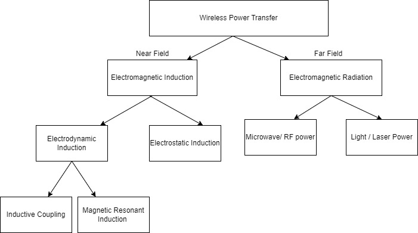

Have you ever wondered how you can charge your phone or iPad without a cable? Or have you thought about how you are able to pay for something with just a tap of your card? What these things have in common is that they require no wires or cables, everything is done wirelessly. To answer your questions, you have wireless power transmission (WPT) to thank, a technique which has been around since the era of Nikola Tesla and has recently become a potential solution to many of our world’s energy supply issues and can revolutionise the way we transmit energy. So, what exactly is WPT and how does it work?

    
</img>

Generally, WPT is the process of transmitting electrical power from a ‘transmitter’ to one or more ‘receivers’ by the means of electromagnetic fields. The ‘transmitter’ would be connected to a source of power such as a mains power line, where it would use the power to produce time-varying electromagnetic fields, using an antenna device like a coil of wire which generates magnetic fields. This would be aimed at a receiving device (a rectenna). The rectenna, which may be in the form of a coil or metal plate, takes this power and converts it back into DC or AC current using a similar process to the transmitter. This current can then can be consumed by an electrical load such as a mobile device.

Now this is similar to another process of wireless transmission known as wireless communications, which involves the transfer of energy to a receiver in order to transmit data through electromagnetic waves. The aim of this process is to transmit information successfully, therefore the amount of power transferred is not of great concern. However, in the case of power transmission, the aim is to be efficient as possible to ensure that the receiver gets as much power as possible from the transmitter. As a result of this, WPT is subject to limitations on the distances it can travel thus restricting the use of this technology for long-range use. However, there are two types of WPT techniques that differ based on the region occupied by the oscillating electric and magnetic fields, they are near-field regions and far-field regions. This can allow us to transmit the power over longer distances using several processes.

A near-field region means that the area is within 1 wavelength of the antenna. The electric and magnetic fields are non-radiative meaning the energy stays close to the transmitter, remaining in the transmitter if there is no receiving device to absorb the energy within the limited range. The size of the antenna devices on both ends has an impact on the size of the fields generated, decreasing exponentially as the distance between the two antennas is greater than their diameters. Since the fields become smaller and smaller, the power transmitted will become very little, rendering it useless for long range transmission. Due to the nature of the near-field components of electric and magnetic fields at relatively larger distances, inductive and capacitive coupling can be used to transmit power over short distances.

Inductive coupling uses magnetic fields to transfer power between two coils of wire. The combination of these coils forms a transformer. An alternating current is passed through the transmitter coil which produces an oscillating magnetic field as a result of Ampere’s law. This magnetic field passes through the receiver coil and induces an alternating voltage, thus creating an alternating current in the receiver. This alternating current can be used to drive an electrical load for example, an electric toothbrush charging stand. Another proficient use of inductive coupling is charging biomedical prosthetic devices implanted into the body such as a cardiac pacemaker or an insulin pump. This removes the need to pass any wires through the body making it safer and more efficient.

Similarly, capacitive coupling makes use of electric fields for the transmission of power between two electrodes. This utilises the concepts of capacitance, the capability of an object or device to store electrical charge, for the transfer of power. The transmitter produces an alternating voltage which is then applied to the metal plate, this induces an oscillating electric field into the receiver 	through electrostatic induction, forming an alternating current in the load circuit. The amount of power transferred in this process is proportional to the frequency, the voltage squared and the capacitance between the plates, which is affected by the distance separated between the two plates. Due to the fact that large amounts of voltage are applied to the electrodes in order to transfer the power, this technique is typically applied to lower power applications as the voltages can be dangerous. Furthermore, as oppose to magnetic fields, electric fields interact more intensely with most materials, including humans. This potentially could lead to an excessive exposure to electromagnetic fields which can have several health effects on humans leading to dizziness or nerve pain. Despite its hazardous nature, capacitive coupling does have an advantage over inductive coupling. Specifically, in capacitive coupling, the field is confined within the capacitor plates, which reduces the potential of interference whereas inductive coupling requires ‘flux confinement’ cores in order to mitigate this.

    
</img>

Resonance can be used on both of these techniques to increase power transfer between the transmitter and receiver. This is achieved through transferring the power by either electric or magnetic fields between two resonant circuits. A resonant circuit consists of an inductor connected to a capacitor; in this case the circuit would contain a coil of wire connected to a capacitor. These two circuits are then tuned to vibrate at the same resonant frequency, amplifying the coupling and power transfer. This technique does come with a few drawbacks, at close ranges the resonant frequency of the system does not remain constant and actually splits into two resonant ‘peaks’. This means that the maximum power transfer is no longer at the original resonant frequency and the system must be tuned to the new resonant peaks. An application of this can be the implementation of power coverage, where a coil in the ceiling can charge electrical components wirelessly within a room such as light bulbs, radios etc. This could lead to potentially reducing the 6 billion batteries disposed each year, contributing to the reduction of toxic waste and groundwater contamination.

Far field techniques are the conjugate to near-field techniques, also known as radiative techniques. This is where the area is beyond 1 wavelength of the antenna. These methods can achieve much longer ranges often reaching several kilometres in range. High directivity antennas or laser light produce beams of energy that can be made into the shape of the receiving area. Diffraction can have an impact on the maximum directivity of the antennas. In far field techniques, visible light and microwaves are the forms of electromagnetic radiation which are best suited for energy transfer. Microwave power can be made more directional, allowing longer power transfer to be achieved. This technique has been proposed for the transmission of energy from orbiting solar power satellites to Earth and even for spacecrafts leaving orbit. As mentioned earlier, diffraction can impact the directivity of antennas meaning that very large diameters are required. This was discovered by NASA in 1978 when studying solar power satellites and they deduced that they required a 1 kilometre transmitting antenna and a 10-kilometre diameter receiving rectenna for a microwave beam. This can be avoided by using shorter wavelengths however this opens it up to potential atmospheric absorption or blockage from rain or water droplets. Furthermore, power can be transmitted by converting electricity into a laser beam that is received and concentrated onto photovoltaic cells. These cells are designed to convert light energy into electricity using the photoelectric effect. This method does hold a few advantages over microwaves for example, the use of collimated monochromatic wavefront propagation allows narrow beam cross-sectional areas for transmission over large distances. This allows it to transfer further without a loss in power. The use of light also means there is no chance of radio-frequency interference making it more efficient. However, there are also some disadvantages of using light beams as they can be dangerous, potentially blinding humans and other animals and even being lethal to both. Also, the conversion between light and electricity is limited as the photovoltaic cells have a maximum efficiency of around 40%-50%. Despite being unaffected by radio frequency, light beams are subject to atmospheric absorption from rain and clouds and could lead to losses of up to 100%. This idea has been implemented in military weapons and aerospace applications and is commonly used for powering commercial and consumer electronics. Due to its potential dangers, laser beam technology must satisfy laser safety requirements set by the IEC.

    
</img>

We have explored how WPT works and all the different techniques within the area, looking at a few applications of this process. Let’s look into more current applications and potential applications which can benefit the world greatly. 

The inequality of reliable electricity access in the world is huge, having a key impact on economic progress and prosperity. Remote islands and farms rely on underwater cables or single lines through difficult terrains. These lines require expensive installation and maintenance and can prohibit people from gaining a reliable power source. WPT offers a solution to these expensive infrastructure upgrades and maintenance over challenging terrain. For example, Stewart Island, a nature reserve could be powered by beaming sustainably generated hydro-energy, reducing the reliance on diesel generators and reducing overall costs for communities and residents. Some areas such as Piha, a costal island in New Zealand, are tucked away behind mountainous terrain and experiences strong winds and storms. This makes it difficult for power lines to remain intact and functionable all year round. WPT can be a significantly cheaper option to install and maintain compared to these power lines as it can overcome these traditional obstacles of terrain and weather. Additionally, WPT could potentially allow us replace generators which have been a common and crucial component of our technological lives. Replacing them means we don’t have to deal with their high running costs, pollution, noisiness, and the hassle from outages. WPT can reduce outage downtime and costs without the need for a generator.

Essentially, WPT and WPT technologies require a direct line of sight between the transmitter and receiver to successfully transfer the energy. In reality we can use this technology for almost anything! With further developments and research into this field, we can imagine a world full of fuel-free vehicles and wirelessly charged electrical components. For example, we could power electric cars or ships even aeroplanes during flight, making our world a much cleaner and cheaper environment to live in. This technology has endless possibilities just waiting to be exploited by aspiring scientists and engineers. Your imagination is the limit.

<h2>Bibliography</h2>

- https://www.sciencedirect.com/topics/engineering/wireless-power-transfer#:~:text=Wireless%20power%20transfer%20%28WPT%29%20is%20the%20transmission%20of,of%20body%20embedded%20sensors%2C%20actuators%2C%20and%20communication%20devices.
- https://emrod.energy/wireless-power-transmission/
- https://en.wikipedia.org/wiki/Wireless_power_transfer
- https://www.geeksforgeeks.org/wireless-power-transmission/
- https://www.watelectrical.com/wireless-power-transmission-technology/#:~:text=Applications%20of%20Wireless%20Power%20Transmission%3A%201%20The%20largest,airplanes%2C%20fuel-free%20rockets%20and%20moving%20robots.%20More%20items

