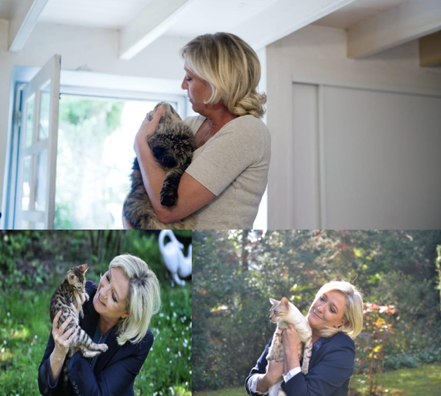

## The Article
Back by popular demand with yet another terrifying and impossible title, please take a moment to truly think before you discount it. Picture your pet; that small ball of fluff or scales that brings you so much joy in your life. A constant form of affection that’s almost as close to you as a child. Your responsibility to care for and nurture. A constant friend through tough times. So, it is no surprise that politicians from all backgrounds, left, right, liberal, or conservative want to hijack your hamster, corrupt your cat and phish your fish  in order to manipulate you politically. Even though this political tool is being used globally, there is no need to fret. This article will seek to wake you from the illusion whilst giving you key steps in order to stop The Powers That Be influencing you, a map to the minefield if you will. And this minefield is littered with “Beware” signs, as these tactics have been and are being used to cover up racism and bigotry everywhere. 

We as a species are naturally drawn to cuteness1. Large eyes and soft features, like those of a human infant, trigger our parental instincts1. Animals that don’t exhibit these two main characteristics are far less likely to be our pets, as animals like insects trigger disgust. “Disgust is a learned emotion…. It’s probably transmitted socially” according to Graham Davey, specialist in phobia at Sussex University1. Therefore, it should be no surprise that the animals we welcome voluntarily into our homes represent this. Statistically speaking, 3/5 of readers will have a pet2, dogs being ever so slightly more popular than cats, 12.5 million to 12.2 million2 (sorry cat people). Out of these animal lovers, 49% would say that their pet is a family member in its own right2. The sheer volume of pets, not just in the UK but around the world, is fruit ripe for the picking of politicians in need of public support, preying on our parental and familial instincts to do so. This is done for a plethora of end goals, but perhaps the most pertinent is for the ultimate of being relatable. 

## Relatability 
It is commonly joked that in American politics, “if you want a friend in Washington get a dog”, and this idea has been taken to the advantage of politicians in the House. In the first television advert of his campaign, Democratic Representative John Barrow let loose a Golden Retriever, the nuclear bomb of relatability, whilst citing the famous joke3. “ Well, I wouldn’t wish Washington on a dog” he adds, as he launches a tennis ball for her off screen, using the down time to criticise other state lawmakers3. When she returns, he quips “She works harder than most of them do”. In the 2012 house election, he defeated the incumbent, popular and previously unopposed House Representative  Lee Anderson by a 6.6% margin4. Barrow had never run in an election previously 4. Now I’m not saying his dog was the sole reason for his election, however, A golden retriever is absolutely ideal in order to become relatable with the public. According to the aptly named Daily Paws, the breed is amongst the most popular in the States in families, displaying key traits of affection friendliness, capability, and trustworthiness5.The inclusion of the family pet for the family man, one who can be depended on, in this advert whether consciously or subconsciously triggers a reaction. This reaction is to affiliate all of those characteristics to Barrow. He is now just like you and I, using the double headed dog hammer of family and reliability to ensure that you vote for him. 

This issue is happening on a far grander stage, just across La Manche in France as well. Everybody’s favourite far-right, Holocaust denying sycophant (what, I never said the article wasn’t politically charged) has now, like a shark sniffing blood, caught on to the scent of those sweet relatability points. For those unaware, the Le Pen family has somewhat lost its footing in the political landscape of France in recent times, most of that coming down to the fact people are less supportive of racist bigots. But in order to distance herself from her father’s comments that gas chambers were a mere “detail” of the Nazi’s in 19876, Le Pen has been using cats to win popularity. In her 2022 Presidential campaign, her social media was a flood of images of her with cats. Here are a couple of my favourites:

    
</img>

    <em>Courtesy of @marine_lepen</em>

Put in context of the horrendous comments of her party’s (Rassemblement Nationale) incredibly far right policies, it is sickening to see what she is doing. For example, she would like to cut the essential and often lifesaving aid given to illegal immigrants into France, by abolishing the AME7. The aide médicale d’Etat, according to her, is a “suction pump”7 bringing illegal immigrants into the country, when in fact saves the lives of those most in need. Not only this, but she wants any foreign nationals who break the law in France to be stripped of their French Nationality, and deportation of those who commit “serious crimes”7.  When seen, without these policies, and just with these photos and the caption “First Cat”6 it is easy to see how she can become very relatable, so relatable that she was projected to win 40% of the vote6. This is the highest majority RN has ever won6 and the only one in which she has made a point about her ailurophilia. Even though she thankfully lost the election, she has gained political legitimacy, with her party’s historic (and present) racist and homophobic policies being almost forgotten because she owns pets. She has become amongst the French a respectable politician6 due to this boost of public relatability facilitated by kittens, a terrifying prospect due to the threat to the liberties of so many that she poses.

However, sometimes this love for animals backfires dramatically on politicians, and a recent example relates to everybody’s favourite British PM. Yes, if COVID, marital, party and economic scandal weren’t enough for Boris Johnson, his slip ups with animals which inevitably would have been used for a publicity win, show us how this issue is closer than one might be ready to admit. Upon the Taliban takeover of Kabul in Afghanistan, a massive British force was mobilised to conduct an immediate evacuation of interests there8. But human interests were not the only thing on Boris’ mind. In a leaked email to the Foreign Office, an official stated that the animal charity Nowzad had “received a lot of publicity” and made a claim that “the PM had authorised their staff and animals to be evacuated”8. On the same day, a private charter was organised by Johnsons private secretary to secure the evacuation of the animals8. When quizzed about why he left Afghans who worked for Britain behind, in favour for airlifting dogs, Johnson stated that it was “complete nonsense”8. As we all know, when Boris says, “complete nonsense” the British public knows it to actually be “completely factual” and it was revealed that 173 dogs and cats had indeed been evacuated in August8. This caused outcry in both the media and in government and was a factor in bringing Boris Johnsons house of cards to come tumbling down and brought fresh allegations into him misleading Parliament. The British evacuation was in general a catastrophe for the Conservative administration, but what was the icing on the cake is that seemingly out of the kindness of his heart, Johnson decided to save the animals. From what we have previously learnt, there is no such thing, and it is highly likely that this was a move that, had the evacuation been conducted better by the army and received better by the public, would have been released to brand Boris as a relatable and caring figure, for animals, not just people. However, the reality is that Johnsons attempt to use animals as political leverage was yet another failure of his government. 

## The Impacts
The relatability gained by having pets has been capitalised on by every politician guilty of doing it. There are indirect examples of the popularity helping to pass laws and policies that may not have passed ordinarily. However, one example of a direct impact that pets have had on politics is in passing one of the most controversial laws in American history. On the 19th of April 1995, an ex-Army soldier called Timothy McVeigh parked a rental truck outside a federal building  in Oklahoma City. After getting into a separate getaway vehicle, he pushed a button and killed 168 people9. The tragedy of the Oklahoma City bombing remains pertinent in American minds to this day and was used as evidence for the necessity of the Effective Death Penalty Act of 199610. Lawmakers jumped at this opportunity, and the law allowed the State to admit illegally obtained evidence to a case, deny the defendant access to it, and only allows the defendant the bare minimum of state defence9. Furthermore, it heavily restricted freedom of speech in allowing the ability to shut down any anti-State rhetoric. The article was criticised for “sacrificing the individual liberties and freedoms guaranteed by the Constitution for a “quick” solution to terrorism”9, with this being specifically worded to target ethnic minorities. Whilst this was being passed, the Clinton administration attempted to draw public attention away from the clear breaches of human rights by a school campaign about his pets. Journalist Nathan Robinson remembers that he was taught about Bill Clinton’s cat Socks and dog Buddy11. The American youth were encouraged to write in letters to the pets across 1996, the campaign being so publicised, that Socks and Buddy received over 300,000 letters12. Instead of having one of the most controversial and racially motivated bills in American history9 being discussed, the public were more enamoured asking questions such as “How does it feel to be top cat?”10. This public blindsiding was one of the first policies used by Clinton in his presidential campaign for re-election in 1996, and the public adoration of his pets was used to stop questions being asked about this radical new policy. Not only this but to ensure that his opinion polls remained high after the midterm elections, he commissioned his wife Hilary Clinton to publish a book entitled Dear Socks, Dear Buddy in 199810. Conveniently, this collection of 80 heart-warming letters was released soon after the case of American-Arab Anti-Discrimination Comm, v. Reno9. The case directly criticised the reduction in freedom of speech and the laws targeting of many plaintiffs due to group affiliation9 and was one of the first cases where the government was questioned over the wording and application of the law. In publishing this collection of letters now, which were first written at the time the law was passed11 again further draws public and media attention away from discussing the Death Penalty Act.  It is clear that Clinton persistently and unceremoniously used Socks and Buddy to divert public attention from human rights abuses and towards him being a relatable and kind-hearted politician. 

## What do we do now?
The premise of this article is not as a fearmongering tactic. But in a world were chasms are being carved into society before our very eyes, it is important that we do not become blindfolded and fall into them. This article does however invite you to ask questions about what you see in political campaigns. To take that one extra step and ask why. Why is Le Pen holding a cat? Why is Clinton releasing a book about his pets? Why is Boris evacuating cats and dogs from Afghanistan? We hold our pets so dear to our lives that we owe them a service to not let their cute little faces fall into the malicious hands of the world elite. In a society where it can seem as though politics is inescapable, let us try to pry our pets from their grip, for it is what they deserve. 

Unconditional love is too valuable to lose.

<h2>References</h2>

1Cute or creepy: Why we love some species, loathe others - cute or creepy (2019) The Economic Times. Available at: <a href="https://economictimes.indiatimes.com/news/international/world-news/cute-or-creepy-why-we-love-some-species-loathe-others/the-cuteness-factor/slideshow/69660382.cms">https://economictimes.indiatimes.com/news/international/world-news/cute-or-creepy-why-we-love-some-species-loathe-others/cute-or-creepy/slideshow/69660379.cms</a> (Accessed: December 8, 2022). 

2Copeland, K. (2022) 16 UK pet ownership statistics to know in 2022: How many brits have pets?, Pet Keen. Available at: https://petkeen.com/pet-ownership-statistics-uk/ (Accessed: December 8, 2022). 

3Espo, D. (2014) Politicians use animals in ads, Mankato Free Press. Available at: https://www.mankatofreepress.com/news/state_national_news/politicians-use-animals-in-ads/article_556a56a4-23d7-11e4-a3e9-0019bb2963f4.html (Accessed: December 11, 2022). 

4John Barrow (Georgia) (no date) Ballotpedia. Available at: https://ballotpedia.org/John_Barrow_(Georgia) (Accessed: December 11, 2022). 

5Katie Mills Giorgio Updated June 22, 2022 (2022) Golden Retriever, Daily Paws. Available at: https://www.dailypaws.com/dogs-puppies/dog-breeds/golden-retriever (Accessed: December 11, 2022). 

6McAuley, J. (2022) The French far right comes on Little Cat Feet, The New Yorker. Available at: https://www.newyorker.com/news/letter-from-europe/the-french-far-right-comes-on-little-cat-feet (Accessed: December 11, 2022). 

7Political positions of Marine Le Pen (2022) Wikipedia. Wikimedia Foundation. Available at: https://en.wikipedia.org/wiki/Political_positions_of_Marine_Le_Pen#Illegal_immigration (Accessed: December 11, 2022). 

8Stone, J. (2022) Boris Johnson personally authorised evacuation of dogs from Afghanistan, email shows, The Independent. Independent Digital News and Media. Available at: https://www.independent.co.uk/news/uk/politics/boris-johnson-dogs-afghanistan-pen-farthing-b2001036.html (Accessed: December 11, 2022). 

9Oklahoma City bombing (2016) FBI. FBI. Available at: https://www.fbi.gov/history/famous-cases/oklahoma-city-bombing (Accessed: December 11, 2022). 

10Are we only burning witches? the antiterrorism and effective death ... (no date). Available at: https://ilj.law.indiana.edu/articles/73/73_2_Beall.pdf (Accessed: December 11, 2022). 

11Robinson, N.J. (2011) Puppaganda: How politicians use pets to convince you of their humanity ❧ current affairs, Current Affairs. Available at: https://www.currentaffairs.org/2021/01/dogaganda-how-politicians-use-pets-to-convince-you-of-their-humanity (Accessed: December 11, 2022). 

12Ayne, S. (2016) Dear Socks, dear buddy, Library of Cats. Available at: https://libraryofcats.wordpress.com/2016/04/21/dear-socks-dear-buddy/ (Accessed: December 11, 2022). 

